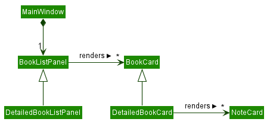
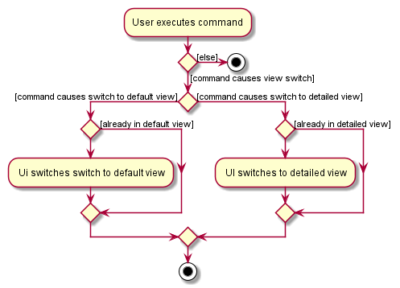
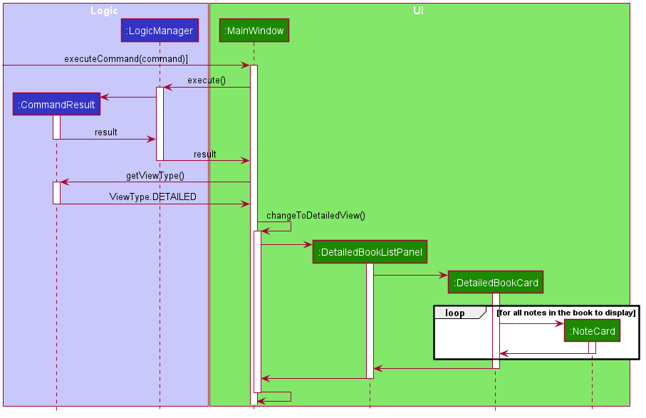
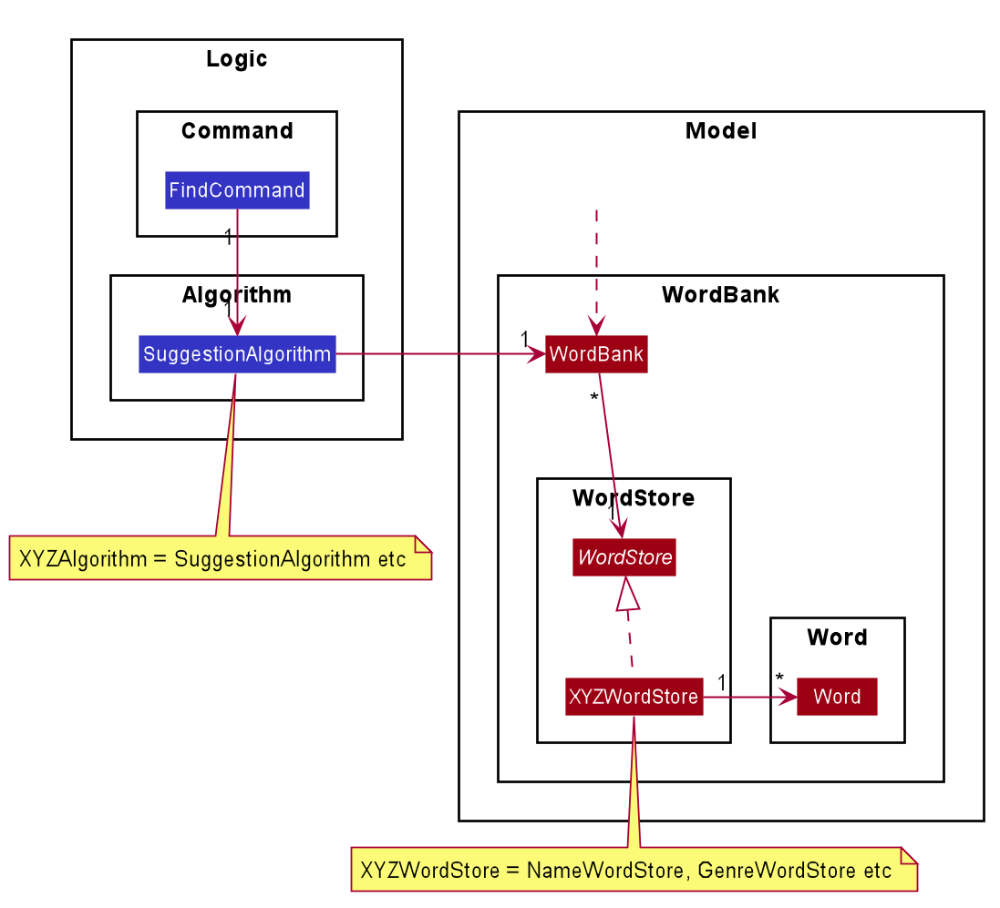
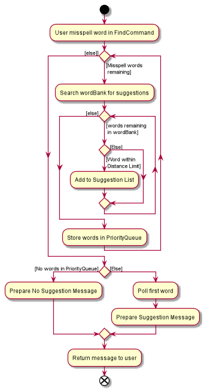
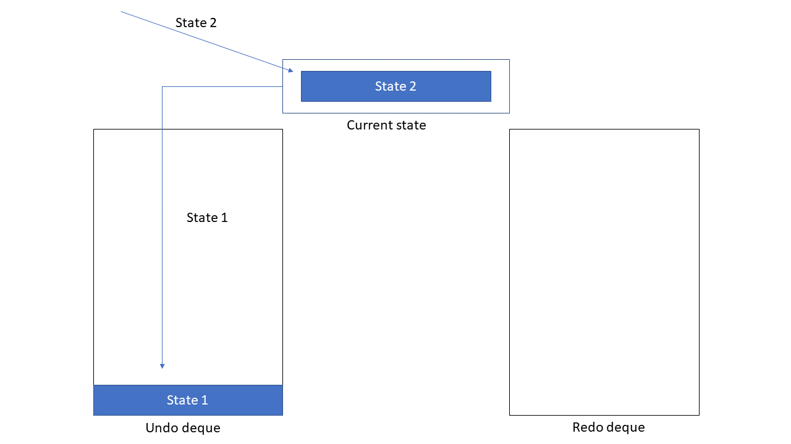
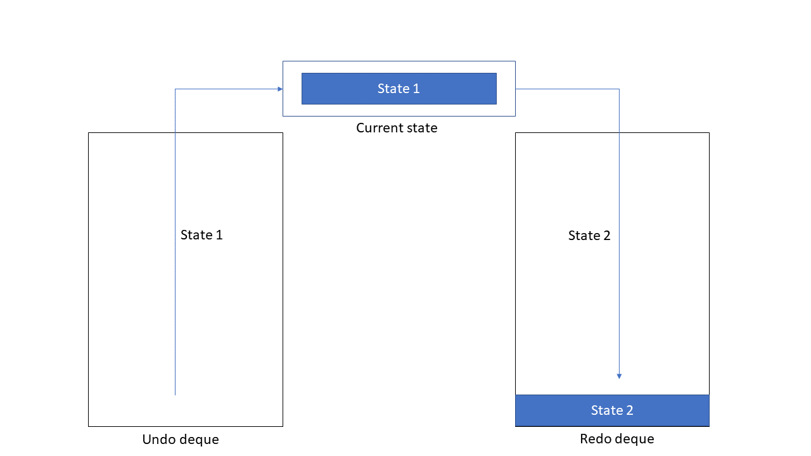
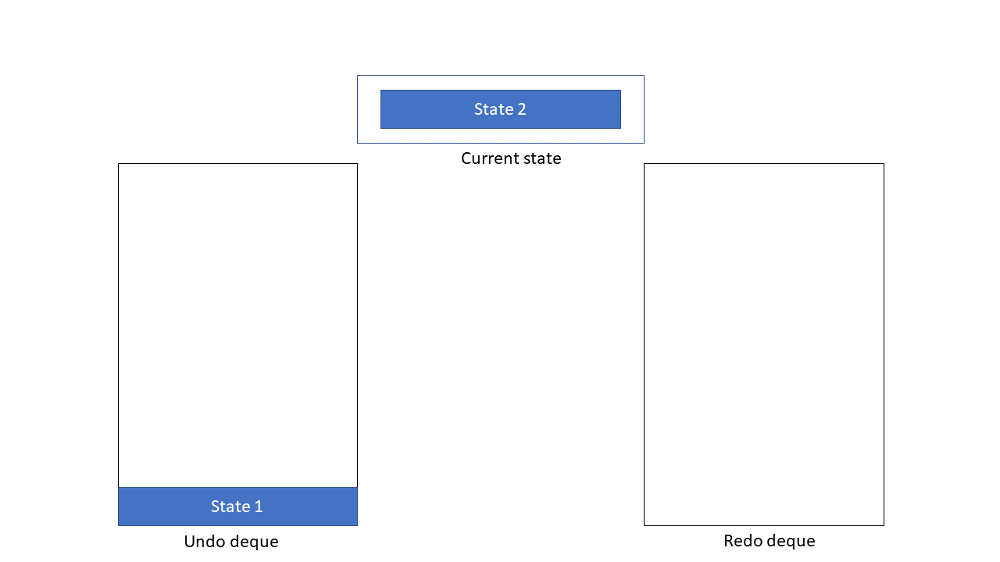
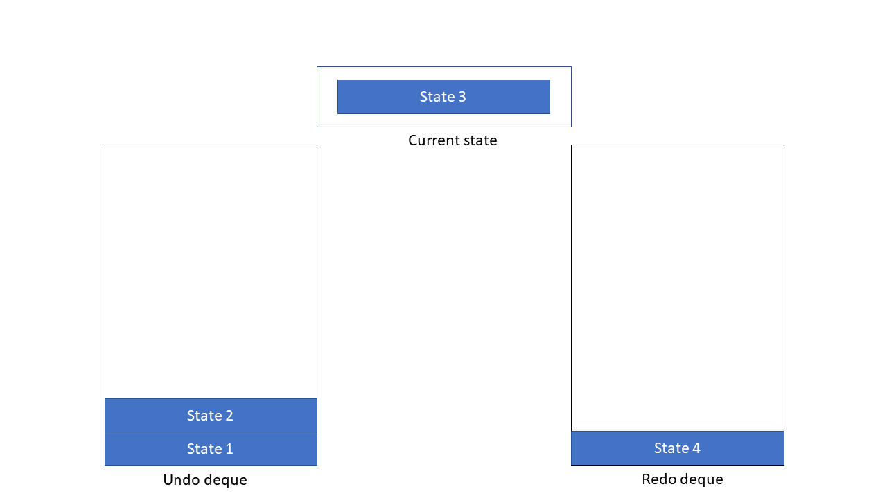

* Table of Contents
{:toc}

--------------------------------------------------------------------------------------------------------------------

## **Setting up, getting started**

Refer to the guide [_Setting up and getting started_](SettingUp.md).

--------------------------------------------------------------------------------------------------------------------

## **Design**

### Architecture

The ***Architecture Diagram*** given above explains the high-level design of the App. Given below is a quick overview of each component.

:bulb: **Tip:** The `.puml` files used to create diagrams in this document can be found in the [diagrams](https://github.com/AY2021S1-CS2103T-F13-2/tp/tree/master/docs/diagrams) folder. Refer to the [_PlantUML Tutorial_ at se-edu/guides](https://se-education.org/guides/tutorials/plantUml.html) to learn how to create and edit diagrams.

**`Main`** has two classes called [`Main`](https://github.com/AY2021S1-CS2103T-F13-2/tp/blob/master/src/main/java/seedu/bookmark/Main.java) and [`MainApp`](https://github.com/AY2021S1-CS2103T-F13-2/tp/blob/master/src/main/java/seedu/bookmark/MainApp.java). It is responsible for,
* At app launch: Initializes the components in the correct sequence, and connects them up with each other.
* At shut down: Shuts down the components and invokes cleanup methods where necessary.

[**`Commons`**](#common-classes) represents a collection of classes used by multiple other components.

The rest of the App consists of four components.

* [**`UI`**](#ui-component): The UI of the App.
* [**`Logic`**](#logic-component): The command executor.
* [**`Model`**](#model-component): Holds the data of the App in memory.
* [**`Storage`**](#storage-component): Reads data from, and writes data to, the hard disk.

Each of the four components,

* defines its *API* in an `interface` with the same name as the Component.
* exposes its functionality using a concrete `{Component Name}Manager` class (which implements the corresponding API `interface` mentioned in the previous point.

For example, the `Logic` component (see the class diagram given below) defines its API in the `Logic.java` interface and exposes its functionality using the `LogicManager.java` class which implements the `Logic` interface.

**How the architecture components interact with each other**

The *Sequence Diagram* below shows how the components interact with each other for the scenario where the user issues the command `delete 1`.

The sections below give more details of each component.

### UI component

**API** :
[`Ui.java`](https://github.com/AY2021S1-CS2103T-F13-2/tp/blob/master/src/main/java/seedu/bookmark/ui/Ui.java)

The UI consists of a `MainWindow` that is made up of parts e.g.`CommandBox`, `ResultDisplay`, `BookListPanel`, `StatusBarFooter` etc. All these, including the `MainWindow`, inherit from the abstract `UiPart` class.

The `UI` component uses JavaFx UI framework. The layout of these UI parts are defined in matching `.fxml` files that are in the `src/main/resources/view` folder. For example, the layout of the [`MainWindow`](https://github.com/AY2021S1-CS2103T-F13-2/tp/blob/master/src/main/java/seedu/bookmark/ui/MainWindow.java) is specified in [`MainWindow.fxml`](https://github.com/AY2021S1-CS2103T-F13-2/tp/blob/master/src/main/resources/view/MainWindow.fxml).
The exception to this is `DetailedBookListPanel`, which shares the same `.fxml` file as `BookListPanel`.

The `UI` component,

* Executes user commands using the `Logic` component.
* Listens for changes to `Model` data so that the UI can be updated with the modified data.

### Logic component

**API** :
[`Logic.java`](https://github.com/AY2021S1-CS2103T-F13-2/tp/blob/master/src/main/java/seedu/bookmark/logic/Logic.java)

1. `Logic` uses the `CommandParser` class to parse the user command.
1. This results in a `Command` object which is executed by the `LogicManager`.
1. The command execution can affect the `Model` (e.g. adding a book).
1. The result of the command execution is encapsulated as a `CommandResult` object which is passed back to the `Ui`.
1. In addition, the `CommandResult` object can also instruct the `Ui` to perform certain actions, such as displaying help to the user.

Given below is the Sequence Diagram for interactions within the `Logic` component for the `execute("delete 1")` API call.

:information_source: **Note:** The lifeline for `DeleteCommandParser` should end at the destroy marker (X) but due to a limitation of PlantUML, the lifeline reaches the end of diagram.

### Model component

**API** : [`Model.java`](https://github.com/AY2021S1-CS2103T-F13-2/tp/blob/master/src/main/java/seedu/bookmark/model/Model.java)

The `Model`,

* stores a `UserPref` object that represents the user’s preferences.
* stores the library data.
* stores a `WordBank` that contains instances of words in Library.
* exposes an unmodifiable `ObservableList<Book>` that can be 'observed' e.g. the UI can be bound to this list so that the UI automatically updates when the data in the list change.
* does not depend on any of the other three components.

:information_source: **Note:** An alternative (arguably, a more OOP) model is given below. It has a `Tag` list in the `Library`, which `Person` references. This allows `Library` to only require one `Tag` object per unique `Tag`, instead of each `Person` needing their own `Tag` object. 

### Storage component

**API** : [`Storage.java`](https://github.com/AY2021S1-CS2103T-F13-2/tp/blob/master/src/main/java/seedu/bookmark/storage/Storage.java)

The `Storage` component,
* can save `UserPref` objects in json format and read it back.
* can save the library data in json format and read it back.

### Common classes

Classes used by multiple components are in the `seedu.bookmark.commons` package.

--------------------------------------------------------------------------------------------------------------------

## **Implementation**

This section describes some noteworthy details on how certain features are implemented.

### Changing Ui view

#### Implementation

*bookmark's* UI supports two types of views: the default, **summarised view** which displays summarised information
regarding the books stored, and the **detailed view** which displays detailed information about a particular book.

`BookListPanel` `BookCard` as well as its corresponding subclasses `DetailedBookListPanel` and `DetailedBookCard` facilitates
the display of book information.
When in the summarised view, `MainWindow` renders `BookListPanel` which displays the book information using `BookCard`,
while in the detailed view, `DetailedBookListPanel` is rendered which displays the book information using
`DetailedBookCard`.

Both `BookListPanel` and `DetailedBookListPanel` makes use of JavaFX's `ListView` to display the
list of `BookCard` or `DetailedBookCard` respectively.

The class diagram below shows the relevant classes involved:

##### Switching between the two views

`MainWindow` and `CommandResult` facilitates the switching between the two views.

`MainWindow#executeCommand()` initializes all changes to what is displayed by the UI by calling `Logic#execute()`
which returns a `CommandResult`. `MainWindow#executeCommand()` is called when user enters a command into the application.
From the returned `CommandResult`, `CommandResult#isDetailedView()` indicates whether the UI should be in the detailed view,
or the default summarised view.

Based on the value returned by `CommandResult#isDetailedView()`, either `MainWindow#changeToDetailedView()` or
`MainWindow#resetView()` is called accordingly.

The activity diagram below illustrates the flow of execution when the UI decides which view to use:

Below is a sequence diagram that shows a scenario whereby the UI switches from the default summarised view to the
detailed view:

#### Design considerations

##### Aspect: What to display DetailedBookCard with

* **Alternative 1 (current choice):** Use JavaFX ListView
  * Pros: Easy to keep UI up to sync with model by overriding ListCell's updateItem method
  * Cons: Can allow for displaying of multiple DetailedBookCards even though the detailed view is currently only meant to show
  one book

* **Alternative 2:** Use other JavaFX layouts
  * Pros: More in-line with the purpose of the detailed view of showing only one book
  * Cons: More work has to be done to sync up the UI with the model.

### Add book

####Implementation

*bookmark* allows Users to add books into the application.

This feature is faciltated mainly by `LogicManager`, `AddCommandParser` and `AddCommand`.

`LogicManager#execute()` handles the command word to create `AddCommandParser` to parse the remaining inputs.
`AddCommandParser#parse()` tokenizes each prefix to create a `Book` object. This `Book` object will be
passed as a parameter to create a `AddCommand` that will be returned to `LogicManager` 
*If there are missing or invalid prefixes, an exception will be thrown with a message to the User.*

`LogicManager#execute()` will call `AddCommand#execute()` to add the `Book` attribute into
the `Model`to return a `CommandResult` as a feedback to the user.
*If there is an existing book with the same name, an exception will be thrown with a message to the User*

Below is an activity diagram which illustrates the flow of events for adding a book

Below is a sequence diagram which illustrates the a scenario where a User adds a valid book  
Command: `add n/Harry Potter g/Fiction tp/1000 b/100`

### Suggestion feature

#### Implementation

*bookmark*'s Did you mean? feature uses the Damerau-Levenshtien algorithm to calculate the distance between the
user-input word and the words in the application Library.

This feature is facilitated by mainly by `SuggestionAlgorithm` and `WordBank` and has coupling with
`ModelManager` and `FindCommand`.

The class diagram below shows the relevant classes involved.

Given below is an example usage scenario and how a Suggestion mechanism behaves at each step.

Step 1: The user inputs the command `find n/h@rry` to find books with `harry` in their names.  
*harry is deliberately mispelled*  
`FindCommand` will implement `execute` and the `model`'s `FilteredList`  will be empty.

Step 2: `FindCommand` will call on `SuggestionAlgorithm#findSuggestions()` to find the closest matching word
in the appropriate `WordStore` of `WordBank`.

Step 3: `SuggestionAlgorithm#calculateDistance()` will be called to calculate the edit distance of `h@rry` and the words in `nameWordBank`
and store words that are within the predefined `DISTANCE_LIMIT`.

Step 4: `FindCommand#execute()` will add each word into a `PriorityQueue` and poll out the word with the smallest distance
to be used as the suggested word.

Step 4*: If no words are within the `DISTANCE_LIMIT` in Step 3, there will not be any words in the `PriorityQueue` and `FindCommand#execute()`
will return a Standard Message for no suggestion.

Below is a sequence diagram that shows a scenario where a suggestion is provided when a typing error is committed.

### \[Proposed\] Undo/redo feature

#### Proposed Implementation

The proposed undo/redo mechanism is facilitated by `VersionedAddressBook`. It extends `AddressBook` with an undo/redo history, stored internally as an `addressBookStateList` and `currentStatePointer`. Additionally, it implements the following operations:
* `VersionedAddressBook#commit()` — Saves the current address book state in its history.
* `VersionedAddressBook#undo()` — Restores the previous address book state from its history.
* `VersionedAddressBook#redo()` — Restores a previously undone address book state from its history.

These operations are exposed in the `Model` interface as `Model#commitAddressBook()`, `Model#undoAddressBook()` and `Model#redoAddressBook()` respectively.

Given below is an example usage scenario and how the undo/redo mechanism behaves at each step.

Step 1. The user launches the application for the first time. The `VersionedAddressBook` will be initialized with the initial address book state, and the `currentStatePointer` pointing to that single address book state.

Step 2. The user executes `delete 5` command to delete the 5th book in the address book. The `delete` command calls `Model#commitAddressBook()`, causing the modified state of the address book after the `delete 5` command executes to be saved in the `addressBookStateList`, and the `currentStatePointer` is shifted to the newly inserted address book state.

Step 3. The user executes `add n/David …​` to add a new book. The `add` command also calls `Model#commitAddressBook()`, causing another modified address book state to be saved into the `addressBookStateList`.

:information_source: **Note:** If a command fails its execution, it will not call `Model#commitAddressBook()`, so the address book state will not be saved into the `addressBookStateList`.

Step 4. The user now decides that adding the book was a mistake, and decides to undo that action by executing the `undo` command. The `undo` command will call `Model#undoAddressBook()`, which will shift the `currentStatePointer` once to the left, pointing it to the previous address book state, and restores the address book to that state.

:information_source: **Note:** If the `currentStatePointer` is at index 0, pointing to the initial AddressBook state, then there are no previous AddressBook states to restore. The `undo` command uses `Model#canUndoAddressBook()` to check if this is the case. If so, it will return an error to the user rather
than attempting to perform the undo.

The following sequence diagram shows how the undo operation works:

:information_source: **Note:** The lifeline for `UndoCommand` should end at the destroy marker (X) but due to a limitation of PlantUML, the lifeline reaches the end of diagram.

The `redo` command does the opposite — it calls `Model#redoAddressBook()`, which shifts the `currentStatePointer` once to the right, pointing to the previously undone state, and restores the address book to that state.

:information_source: **Note:** If the `currentStatePointer` is at index `addressBookStateList.size() - 1`, pointing to the latest address book state, then there are no undone AddressBook states to restore. The `redo` command uses `Model#canRedoAddressBook()` to check if this is the case. If so, it will return an error to the user rather than attempting to perform the redo.

Step 5. The user then decides to execute the command `list`. Commands that do not modify the address book, such as `list`, will usually not call `Model#commitAddressBook()`, `Model#undoAddressBook()` or `Model#redoAddressBook()`. Thus, the `addressBookStateList` remains unchanged.

Step 6. The user executes `clear`, which calls `Model#commitAddressBook()`. Since the `currentStatePointer` is not pointing at the end of the `addressBookStateList`, all address book states after the `currentStatePointer` will be purged. Reason: It no longer makes sense to redo the `add n/David …​` command. This is the behavior that most modern desktop applications follow.

The following activity diagram summarizes what happens when a user executes a new command:

#### Design consideration:

##### Aspect: How undo & redo executes

* **Alternative 1 (current choice):** Saves the entire address book.
  * Pros: Easy to implement.
  * Cons: May have performance issues in terms of memory usage.

* **Alternative 2:** Individual command knows how to undo/redo by
  itself.
  * Pros: Will use less memory (e.g. for `delete`, just save the book being deleted).
  * Cons: We must ensure that the implementation of each individual command are correct.

_{more aspects and alternatives to be added}_

### \[Proposed\] Data archiving

_{Explain here how the data archiving feature will be implemented}_

--------------------------------------------------------------------------------------------------------------------

## **Documentation, logging, testing, configuration, dev-ops**

* [Documentation guide](Documentation.md)
* [Testing guide](Testing.md)
* [Logging guide](Logging.md)
* [Configuration guide](Configuration.md)
* [DevOps guide](DevOps.md)

--------------------------------------------------------------------------------------------------------------------

## **Appendix: Requirements**

### Product scope

**Target user profile**:

* has a need to keep track of pages stopped at for multiple books
* has a need to keep track of library loans
* prefer desktop apps over other types
* can type fast
* prefers typing to mouse interactions
* is reasonably comfortable using CLI apps

**Value proposition**: manage bookmarks and library loans faster than a typical mouse/GUI driven app. Removes the need for physical bookmarks and loan receipts.

### User stories

Priorities: High (must have) - `* * *`, Medium (nice to have) - `* *`, Low (unlikely to have) - `*`

| Priority | As a …​                                    | I want to …​                                                                 | So that I can…​                                                         |
| -------- | ------------------------------------------ | -------------------------------------------------------------------------- | ---------------------------------------------------------------------- |
| `* * *`  | user                                       | see all the data of the book                                               | get information about the book                                         |
| `* * *`  | user                                       | add a new book                                                             | track my progress                                                      |
| `* * *`  | user                                       | delete a book                                                              | remove books that I no longer read                                     |
| `* * *`  | user                                       | find a book by name                                                        | locate details of books without having to go through the entire list   |
| `* * *`  | user                                       | see all the data about a particular book (title, bookmark, progress)                                                        | locate details of books without having to go through the entire list   |
| `* * *`  | user                                       | view a list of all the books and their progress                            | conveniently check my progress on all my books                         |
| `* * *`  | user                                       | update the data of a book                                                  |                                                                        |
| `* *`    | user                                       | classify my books according to genre                                       | organise my books better                                               |
| `* *`    | analytical user                            | write down my thoughts on a book                                           | re-read my analysis later                                              |
| `* *`    | user                                       | create my own classifications for genres not in the application            | organise the books to my liking                                        |
| `* *`    | Kindle user                                | have a clearer representation of my progress                               | conveniently get my progress without navigating to the Kindle screen   |
| `* * *`  | forgetful user                             | keep track of my loan expiry                                               | remember to return the book or extend the loan                         |
| `*`      | user                                       | have a visual representation of my loans expiry period                     | instantly know the urgency of each loan                                |
| `*`      | user                                       | set reminders for a book loan                                              | be reminded to return my book on time                                  |
| `* *`    | user                                       | place tags or notes at different pages                                     | stop using sticky notes                                                |
| `* * *`  | user                                       | have an easy interface                                                     | easily navigate through the system with minimal difficulty             |
| `* * *`  | user                                       | have a help page                                                           | find out how to use the app                                            |
| `* *`    | user                                       | have a few functions that I can use seamlessly                             | learn the app easily without bothering with large numbers of functions |
| `* *`    | user                                       | be able to edit my tags and reflections                                    | edit mistakes and typos                                                |
| `* *`    | careless user                              | undo any wrong commands that i’ve entered                                  |                                                                        |
| `*`      | user                                       | have colour coded tags                                                     | so that I can easily differentiate important tags from the rest        |
| `*`      | user                                       | customise the look of the application                                      | make it feel personal                                                  |
| `*`      | user                                       | have a summary page for statistics on the books I've read                  |                                                                        |
| `*`      | user                                       | be able to resize the application                                          | fit it to different screens                                            |
| `* *`    | user                                       | be able to filter my books by Lexicographic order, Date, Reading, Finished | get the information I'm looking for                                    |
| `*`      | user                                       | see and modify my current settings                                         |                                                                        |
| `* * *`  | user                                       | have a home page that summarises important details                         | conveniently access the most important information                     |
| `* *`    | beginner user                              | have default settings                                                      | skip configuring them at the start                                     |
| `*`      | user                                       | customise the background by uploading my own photo                         | get the information I'm looking for                                    |

### Use cases

(For all use cases below, the **System** is `bookmark` and the **Actor** is the `user`, unless specified otherwise)

**Use case: UC01 - Add a book**

**MSS**

1. User requests to add a book.
2. bookmark adds the book.

    Use case ends

**Extensions**

* 1a. User provides the wrong code.

    * 1a1. bookmark returns an error message.

    Use case ends.

* 1b. User provides a non-numeral for total pages or bookmarked page.

    * 1b1. bookmark returns an error message.

    Use case ends.

* 1c. Provided bookmarked page is larger than total pages.

    * 1c1. bookmark returns an error message.

    Use case ends.

**Use case: UC02 - View a book**

**MSS**

1. User <u>requests to list all books (UC05)</u>.
2. User requests to view a specific book using its index on list.
3. bookmark returns title, bookmark and progress of the book to user.

    Use case ends.

**Extensions**

* 2a. The index given is invalid.

    * 3a1. bookmark returns an error message.

      Use case resumes at step 2.

**Use case: UC03 - Delete a book**

**MSS**

1.  User <u>requests to list all books (UC05)</u>.
2.  User requests to delete a specific book using its index on list.
3.  bookmark deletes the book.

    Use case ends.

**Extensions**

* 2a. The index given is invalid.

    * 2a1. bookmark returns an error message.

      Use case resumes at step 2.

**Use case: UC04 - Edit a book**

**MSS**

1. User <u>requests to list all books (UC05)</u>.
2. User requests to edit a specific book using its index on list.
3. The requested entry is updated

    Use case ends.

**Extensions**

* 2a. The index given is invalid

    * 2a1. bookmark returns an error message

    Use case resumes at step 2.

 * 2b. The requested entry to update is invalid

    * 2b1. bookmark returns an error message

    Use case resumes at step 2.

 * 2c. The provided value for the entry to update is invalid

    * 2c1. bookmark returns an error message

    Use case resumes at step 2.

**Use Case: UC05 - List all books**

**MSS**

1. User requests to list all books
2. bookmark returns a list of books

    Use case ends

**Extensions**

* 1a. The book list is empty
    * 1a1. bookmark returns a message informing user that book list is empty

    Use case ends

**Use Case: UC06 - Help**

**MSS**

1. User requests to see the Help page
2. bookmark returns the Help page

    Use case ends

### Non-Functional Requirements

1.  Should work on any _mainstream OS_ as long as it has Java `11` or above installed.
2.  Should be able to hold up to 1000 books without a noticeable sluggishness in performance for typical usage.
3.  A user with above average typing speed for regular English text (i.e. not code, not system admin commands) should be able to accomplish most of the tasks faster using commands than using the mouse.
4.  The user interface should be self-explanatory and intuitive for first time users.
5.  The app should give proper indications to user when user action is in an invalid format.
6.  The app should be accessible via the downloaded JAR file without any other installations needed.

*{More to be added}*

### Glossary

* **Mainstream OS**: Windows, Linux, Unix, OS-X
* **Private contact detail**: A contact detail that is not meant to be shared with others

--------------------------------------------------------------------------------------------------------------------

## **Appendix: Instructions for manual testing**

Given below are instructions to test the app manually.

:information_source: **Note:** These instructions only provide a starting point for testers to work on;
testers are expected to do more *exploratory* testing.

### Launch and shutdown

1. Initial launch

   1. Download the jar file and copy into an empty folder

   1. Double-click the jar file Expected: Shows the GUI with a set of sample contacts. The window size may not be optimum.

1. Saving window preferences

   1. Resize the window to an optimum size. Move the window to a different location. Close the window.

   1. Re-launch the app by double-clicking the jar file. 
       Expected: The most recent window size and location is retained.

1. _{ more test cases …​ }_

### Deleting a book

1. Deleting a book while all books are being shown

   1. Prerequisites: List all books using the `list` command. Multiple books in the list.

   1. Test case: `delete 1` 
      Expected: First contact is deleted from the list. Details of the deleted contact shown in the status message. Timestamp in the status bar is updated.

   1. Test case: `delete 0` 
      Expected: No book is deleted. Error details shown in the status message. Status bar remains the same.

   1. Other incorrect delete commands to try: `delete`, `delete x`, `...` (where x is larger than the list size) 
      Expected: Similar to previous.

1. _{ more test cases …​ }_

### Saving data

1. Dealing with missing/corrupted data files

   1. _{explain how to simulate a missing/corrupted file, and the expected behavior}_

1. _{ more test cases …​ }_
