* Table of Contents
{:toc}

--------------------------------------------------------------------------------------------------------------------
## **Introduction**

### Purpose 

This document is written to describe the architecture and software design decisions for the desktop application, _bookmark_

### Scope

The goal of this document is to cover the high-level system architecture and design. It will also cover the implementation of each
feature in _bookmark_.

### Audience 

The intended audience is any person who is looking to understand the system architecture and design of _bookmark_

--------------------------------------------------------------------------------------------------------------------

## **Setting up, getting started**

Refer to the guide [_Setting up and getting started_](SettingUp.md).

--------------------------------------------------------------------------------------------------------------------

## **Design**

### Architecture

The ***Architecture Diagram*** given above explains the high-level design of the App. Given below is a quick overview of each component.

:bulb: **Tip:** The `.puml` files used to create diagrams in this document can be found in the [diagrams](https://github.com/AY2021S1-CS2103T-F13-2/tp/tree/master/docs/diagrams) folder. Refer to the [_PlantUML Tutorial_ at se-edu/guides](https://se-education.org/guides/tutorials/plantUml.html) to learn how to create and edit diagrams.

**`Main`** has two classes called [`Main`](https://github.com/AY2021S1-CS2103T-F13-2/tp/blob/master/src/main/java/seedu/bookmark/Main.java) and [`MainApp`](https://github.com/AY2021S1-CS2103T-F13-2/tp/blob/master/src/main/java/seedu/bookmark/MainApp.java). It is responsible for,
* At app launch: Initializes the components in the correct sequence, and connects them up with each other.
* At shut down: Shuts down the components and invokes cleanup methods where necessary.

[**`Commons`**](#common-classes) represents a collection of classes used by multiple other components.

The rest of the App consists of four components.

* [**`UI`**](#ui-component): The UI of the App.
* [**`Logic`**](#logic-component): The command executor.
* [**`Model`**](#model-component): Holds the data of the App in memory.
* [**`Storage`**](#storage-component): Reads data from, and writes data to, the hard disk.

Each of the four components,

* defines its *API* in an `interface` with the same name as the Component.
* exposes its functionality using a concrete `{Component Name}Manager` class (which implements the corresponding API `interface` mentioned in the previous point.

For example, the `Logic` component (see the class diagram given below) defines its API in the `Logic.java` interface and exposes its functionality using the `LogicManager.java` class which implements the `Logic` interface.

**How the architecture components interact with each other**

The *Sequence Diagram* below shows how the components interact with each other for the scenario where the user issues the command `delete 1`.

The sections below give more details of each component.

### UI component

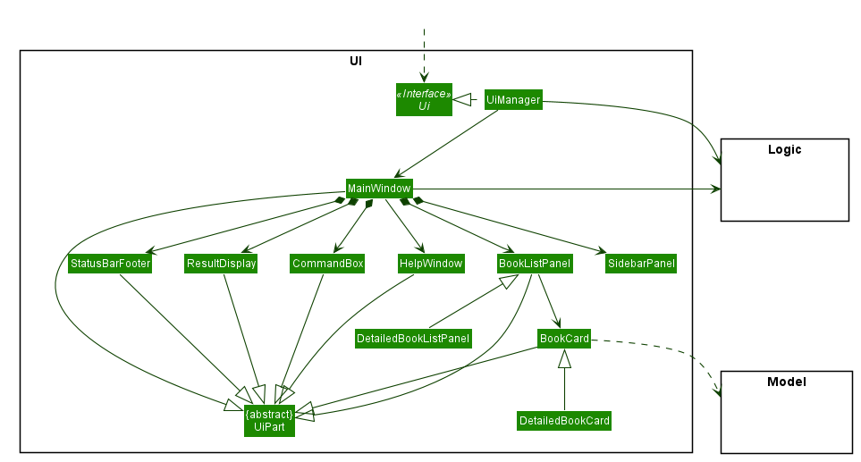

**API** :
[`Ui.java`](https://github.com/AY2021S1-CS2103T-F13-2/tp/blob/master/src/main/java/seedu/bookmark/ui/Ui.java)

The UI consists of a `MainWindow` that is made up of parts e.g.`CommandBox`, `ResultDisplay`, `BookListPanel`, `StatusBarFooter` etc. All these, including the `MainWindow`, inherit from the abstract `UiPart` class.

The `UI` component uses JavaFx UI framework. The layout of these UI parts are defined in matching `.fxml` files that are in the `src/main/resources/view` folder. For example, the layout of the [`MainWindow`](https://github.com/AY2021S1-CS2103T-F13-2/tp/blob/master/src/main/java/seedu/bookmark/ui/MainWindow.java) is specified in [`MainWindow.fxml`](https://github.com/AY2021S1-CS2103T-F13-2/tp/blob/master/src/main/resources/view/MainWindow.fxml).

The `UI` component,

* Executes user commands using the `Logic` component.
* Listens for changes to `Model` data so that the UI can be updated with the modified data.
* Has two different states, a default summarised view, and a detailed view.

### Logic component

**API** :
[`Logic.java`](https://github.com/AY2021S1-CS2103T-F13-2/tp/blob/master/src/main/java/seedu/bookmark/logic/Logic.java)

1. `Logic` uses the `CommandParser` class to parse the user command.
1. This results in a `Command` object which is executed by the `LogicManager`.
1. The command execution can affect the `Model` (e.g. adding a book).
1. The result of the command execution is encapsulated as a `CommandResult` object which is passed back to the `Ui`.
1. In addition, the `CommandResult` object can also instruct the `Ui` to perform certain actions, such as displaying help to the user.

Given below is the Sequence Diagram for interactions within the `Logic` component for the `execute("delete 1")` API call.

:information_source: **Note:** The lifeline for `DeleteCommandParser` should end at the destroy marker (X) but due to a limitation of PlantUML, the lifeline reaches the end of diagram.

### Model component

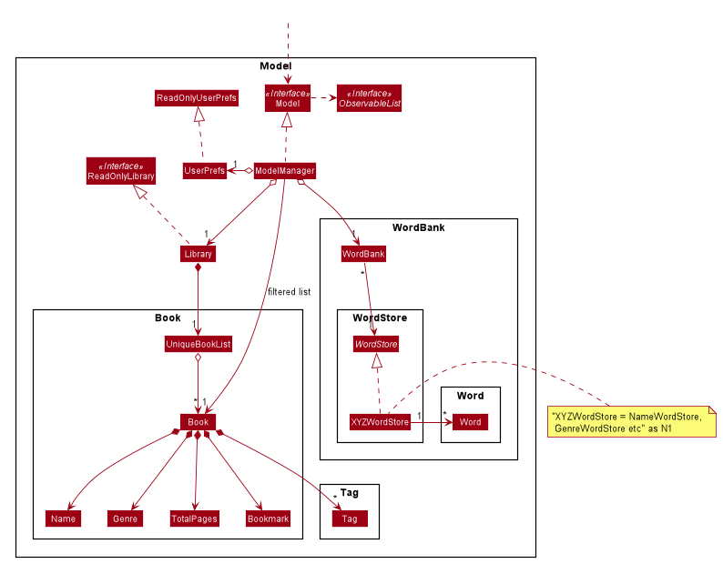

**API** : [`Model.java`](https://github.com/AY2021S1-CS2103T-F13-2/tp/blob/master/src/main/java/seedu/bookmark/model/Model.java)

The `Model`,

* stores a `UserPref` object that represents the user’s preferences.
* stores a `Library` object that represents the data added by the user.
* stores a `WordBank` that contains instances of words in Library.
* exposes an unmodifiable `ObservableList<Book>` that can be 'observed' e.g. the UI can be bound to this list so that the UI automatically updates when the data in the list change.
* does not depend on any of the other three components.

### Storage component

**API** : [`Storage.java`](https://github.com/AY2021S1-CS2103T-F13-2/tp/blob/master/src/main/java/seedu/bookmark/storage/Storage.java)

The `Storage` component,
* can save `UserPref` objects in json format and read it back.
* can save the library data in json format and read it back.

### Common classes

Classes used by multiple components are in the `seedu.bookmark.commons` package.

--------------------------------------------------------------------------------------------------------------------

## **Implementation**

This section describes some noteworthy details on how certain features are implemented.

### Changing Ui view

#### Implementation

*bookmark's* UI supports two types of views: the default, **summarised view** which displays summarised information
regarding the books stored, and the **detailed view** which displays detailed information about a particular book.

`BookListPanel` `BookCard` as well as its corresponding subclasses `DetailedBookListPanel` and `DetailedBookCard` facilitates
the display of book information.
When in the summarised view, `MainWindow` renders `BookListPanel` which displays the book information using `BookCard`,
while in the detailed view, `DetailedBookListPanel` is rendered which displays the book information using
`DetailedBookCard`. 

Both `BookListPanel` and `DetailedBookListPanel` makes use of JavaFX's `ListView` to display the `BookCard` or `DetailedBookCard`
respectively.

The class diagram below shows the relevant classes involved:

##### Switching between the two views

`MainWindow` and `CommandResult` facilitates the switching between the two views.

`MainWindow#executeCommand()` initializes all changes to what is displayed by the UI by calling `Logic#execute()`
which returns a `CommandResult`. `MainWindow#executeCommand()` is called when user enters a command into the application.
From the returned `CommandResult`, `CommandResult#getViewType()` indicates how the UI should switch its view.
`CommandResult#getViewType()` returns a `ViewType`, of which there are three types: 
   * `ViewType.DEFAULT` - Instructs UI to switch to the default, summarised view
   * `ViewType.DETAILED` - Instructs UI to switch to the detailed, single book view
   * `ViewType.MOST_RECENTLY_USED` - Instructs UI to stay in whatever view it is in

Based on the type of `ViewType` returned by `CommandResult#getViewType()`, `MainWindow#resetView()`,
`MainWindow#changeToDetailedView()`, or no method is called accordingly.

The activity diagram below illustrates the flow of execution when the UI decides which view to use:

Below is a sequence diagram that shows a scenario whereby the UI switches from the default summarised view to the
detailed view:

#### Design considerations

##### Aspect: What to display DetailedBookCard with

* **Alternative 1 (current choice):** Use JavaFX ListView
  * Pros: Easy to keep UI up to sync with model by overriding ListCell's updateItem method
  * Cons: Extra care must be taken to not allow multiple books to be displayed as detailed view is only meant to show
  one book

* **Alternative 2:** Use other JavaFX layouts
  * Pros: More in-line with the purpose of the detailed view of showing only one book
  * Cons: More work has to be done to sync up the UI with the model.
  
### General _bookmark_ Command Logic

_bookmark_'s commands generally follow the same procedure. The following section will explain the 
general flow of events for the following commands: 
* `add`
* `list`
* `view`
* `edit`
* `delete` 

The listed commands follow a similar sequence diagram as adding a book. These commands are 
facilitated by `LogicManager`, `ModelManager`, `XYZCommandParser` and `XYZCommand` where XYZ refers to the specific command.
eg. List, View, Edit etc. 

`LogicManager` will handle the user input by first identifying the type of command (eg. Add, List, View, Edit etc.) and create a 
`XYZCommandParser` object that will handle the remaining user input if any to produce a `XYZCommand`. 

`XYZCommand` will then handle the specific command through `XYZCommand#execute()`. This method 
interacts with and modifies `ModelManager` to display the appropriate
list of book(s). A `CommandResult` object which contains the return message 
to the User will be created by `XYZCommand` and passed to the UI component to be displayed to the User.

*If the commands are in incorrect format, an exception message will be passed to the UI component to be displayed to the User*

#### Implementation

In this section, `Add` command will be used as an example.

This feature is facilitated mainly by `LogicManager`, `ModelManager`, `AddCommandParser` and `AddCommand`.

Step 1: `LogicManager#execute()` handles the command to identify the type of command (eg. Add)
 to create `AddCommandParser` to parse the remaining inputs. `AddCommandParser#parse()` tokenizes each prefix to create a `Book` object.  

Step 2: This `Book` object will be passed as a parameter to create a `AddCommand` that will be returned to `LogicManager` 
*If there are missing or invalid prefixes, an exception will be thrown with a message to the User.*

Step 3: `LogicManager#execute()` will call `AddCommand#execute()` to add the `Book` into
the `Model` via `ModelManager#addBook()`. Subsequently, `ModelManager#sortByDefaultComparator()` would be called
to sort the internal book list according to the user's sorting preference, if any.  
This method will return a `CommandResult` object which contains the return message to be displayed for the user.  

Step 4: `CommandResult` is returned as a feedback to the user.  
*If there is an existing book with the same name, an exception will be thrown with a message to the User*

Below is an activity diagram which illustrates the flow of events for adding a book

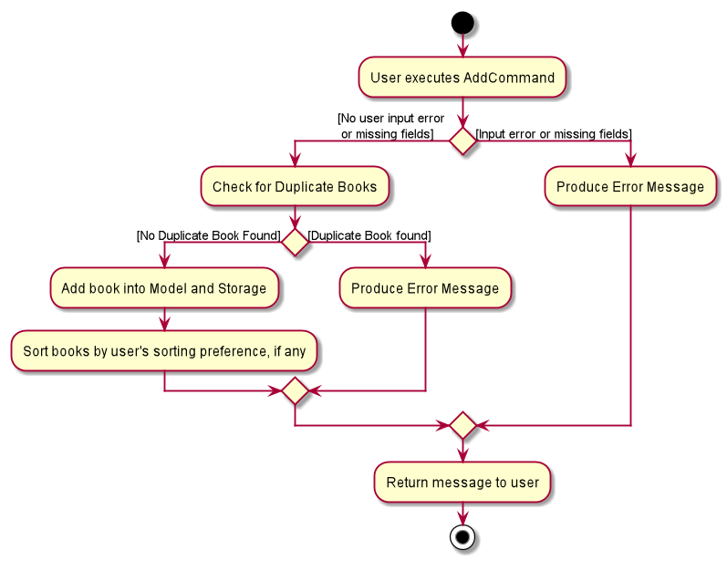

Below is a sequence diagram which illustrates the a scenario where a User adds a valid book  
Command: `add n/Harry Potter g/Fiction tp/1000 b/100`

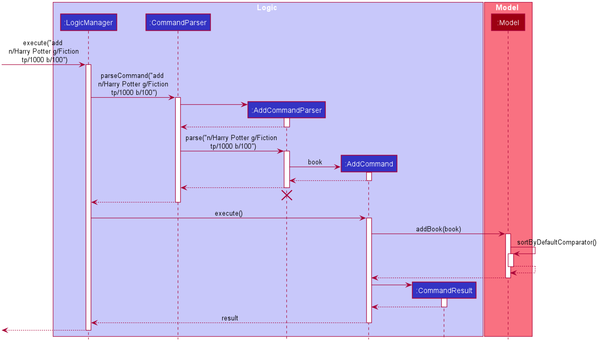 

### Find feature

#### Implementation

*bookmark* allows users to find books by a specified field.

This feature is facilitated mainly by `ModelManager`, `FindCommandParser` and `FindCommand`.

The find mechanism is facilitated by `ModelManager`, specifically, the `ModelManager#updateFilteredBookList()` method. 
`ModelManager#updateFilteredBookList()` takes in a single parameter, a `predicate`, and applies the `predicate` 
on all elements of the observable book list. Books that satisfy the `predicate` remain in the 
list, while elements that do not are removed and omitted from the user's view. Currently, the `find` command 
supports finding by name, genre and tag fields, and can also filter completed & non-completed books.

Given below is an example usage scenario and how the find mechanism alters `FilteredList` at each step.

Step 1. The user launches the application for the first time. `FilteredList` is initialised with the user's book data.

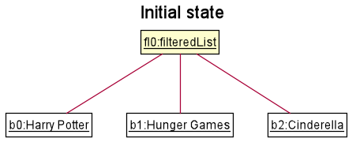

Step 2. The user executes `find n/ Harry` command to find all books with Harry in the Name field. The 
`NameContainsKeywordsPredicate` predicate is generated and is used as a filter in this scenario.

#### Filtering the FilteredList
The `FindCommandParser#parse()` parses the `find` command input, and checks for input errors for which if found,
would throw an error. Subsequently, `FindCommandParser#predicateGenerator()` generates a predicate based on the 
user's input keyword(s) and filtering prefix. The resulting `predicate` is used to generate a new `FindCommand` object, 
and when `FindCommand#execute()` is called, the `predicate` is passed to `ModelManager#updateFilteredBookList()`,
where the filtering of the observable book list based on the `predicate` occurs. 

The activity diagram below illustrates the flow of execution when the user inputs a `find` command.

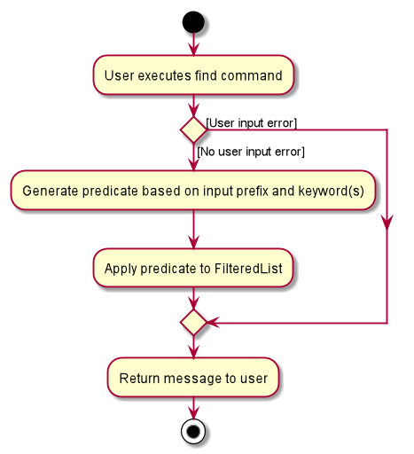

Below is a sequence diagram that shows a scenario whereby the user decides to find the keyword `Harry` in the book name 
field. 
Command : `find n/ Harry`

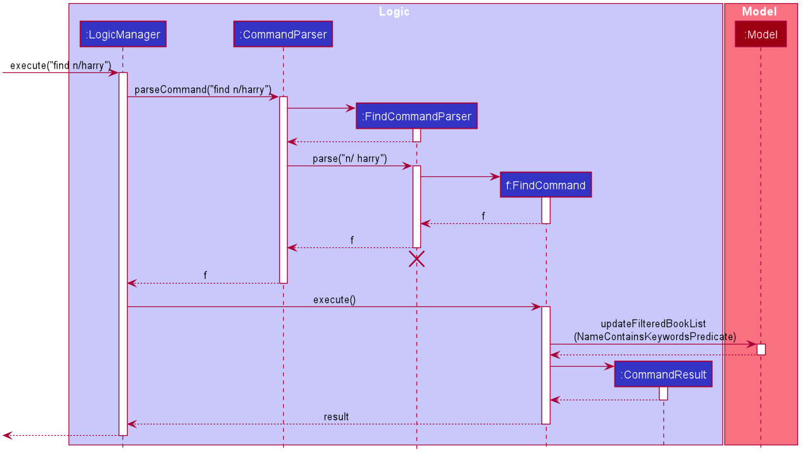

#### Design considerations

##### Aspect: Finding within user specified field or in all fields

* **Alternative 1 (current choice):** Finding keywords within specified field
  * Pros: Allows the user to streamline their search and find their desired book quicker.
  * Cons: Could be a drawback if the user forgets which field he used the keyword in.
  
* **Alternative 2:** Finding keywords in all fields
  * Pros: Allows the user to find all books with the keyword in any input field, which could be an advantage if 
  the user uses the keyword for multiple fields.
  * Cons: Might not be easy to find specific books, i.e. cannot streamline the search as well.

### Sort feature

#### Implementation 

*bookmark* allows Users to sort books by a specified field.

This feature is facilitated mainly by `ModelManager`, `SortCommandParser` and `SortCommand`.

`ModelManager#sortFilteredBookList()` takes in a single parameter, a `comparator`, and applies the `comparator` on all elements
of the internal observable book list. Book's are sorted according to the input comparator in ascending order. 

`ModelManager#setSortingPreference()` takes in a single parameter, a `newSortingPreference`, and updates the sorting preference 
in the `preferences.json` file. Thereafter, the specified sorting mechanism will apply to the user until the user decides to change 
the sorting mechanism using the sort command. 

Currently, the `sort` command supports sorting by name, genre, bookmark, and reading progress.

#### Sorting the ObservableList
The `SortCommandParser#parse()` parses the `sort` command input, and checks for input errors for which if found,
would throw an error. Subsequently, `ComparatorGenerator#comparatorGenerator()` generates a comparator based on the 
user's `inputPrefix`. `inputPrefix` and the resultant `comparator` are used to generate a new `SortCommand` object.
When `SortCommand#execute()` is called, `inputPrefix` is passed to `ModelManager#setSortingPreference()`, where 
updating of user sorting preferences in `preferences.json` occurs. `comparator` is passed to `ModelManager#sortFilteredBookList()`,
where sorting of the internal observable list based on the `comparator` occurs.

The activity diagram below illustrates the flow of execution when the user inputs a `sort` command.

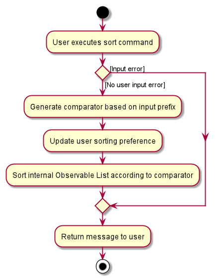

Below is a sequence diagram that shows a scenario whereby the user decides to sort books by the name field.
Command : `sort n/`

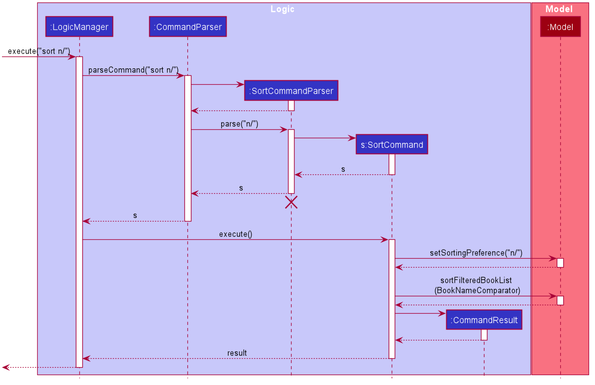

##### Aspect: Sorting visible observable list or internal observable list

* **Alternative 1 (current choice):** Sorting internal observable list
  * Pros: Allows user to set sorting preference. When the user exits and reopens the application, the books would remain
  in the sorted order.
  * Cons: Could be a drawback if the user only wants to sort for temporary view.
  
* **Alternative 2:** Sorting visible observable list
  * Pros: Sorts the user's book list temporarily, which is useful if the user only wants the sorted view momentarily.
  * Cons: Book list would always return to default view after subsequent commands which could be distracting.

### Suggestion feature

#### Implementation

*bookmark*'s Did you mean? feature uses the Damerau-Levenshtien algorithm to calculate the distance between the
user-input word and the words in the application Library.

The `Edit Distance` refers to the number of steps needed to change difference between two words. 
This mechanism is implemented through 3 operations: 
1. Addition
2. Deletion
3. Transposition (Swapping)

For example: 
* Hbrry -> Harry (Edit Distance: 1)
* Hrry -> Harry (Edit Distance: 1)
* Hrary -> Harry (Edit Distance 1)
* Haarry -> Harry (Edit Distance 1)

The suggestion mechanism is facilitated by `Logic` Component through `FindCommand` which calls on `SuggestionAlgorithm` if 
no books can be found.
`SuggestionAlgorithm` will call on `WordBank` in `Model` for the stored words required to complete the mechanism.
`SuggestionAlgorithm` will implement the following operations:
* `SuggestionAlgorithm#findSuggestions()` — Filters the relevant words to be returned as a suggestion
* `SuggestionAlgorithm#calculateDistance()` — Calculate the EditDistance of the source word and words in the WordBank

The class diagram below shows the relevant classes involved.

Given below is an example usage scenario and how a Suggestion mechanism behaves at each step.

Step 1: The user inputs the command `find n/h@rry` to find books with `harry` in their names.  
*harry is deliberately mispelled*  
`FindCommand` will implement `execute` and the `model`'s `FilteredList`  will be empty.

Step 2: Since no books are found, `FindCommand` will call on `SuggestionAlgorithm#findSuggestions()` to find the closest matching word
in the appropriate `WordStore` of `WordBank`.

Step 3: `SuggestionAlgorithm#calculateDistance()` will be called to calculate the edit distance of `h@rry` and the words in `nameWordBank`
and store words that are within the predefined `DISTANCE_LIMIT`.

Step 4: `FindCommand#execute()` will add each word into a `PriorityQueue` and poll out the word with the smallest distance
to be used as the suggested word.

Step 4*: If no words are within the `DISTANCE_LIMIT` in Step 3, there will not be any words in the `PriorityQueue` and `FindCommand#execute()`
will return a Standard Message for no suggestion.

_Within the `SuggestionAlgorithm#FindSuggestion()`_  

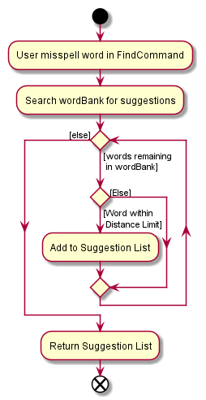 

_Within `FindCommand#execute()`_

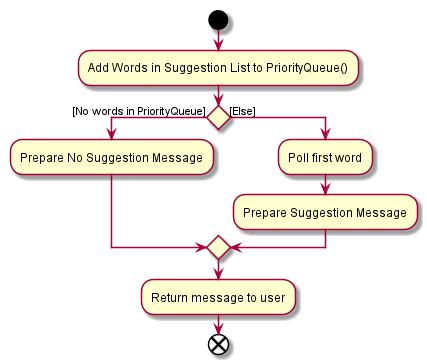

Below is a sequence diagram that shows a scenario where a suggestion is provided when a typing error is committed.

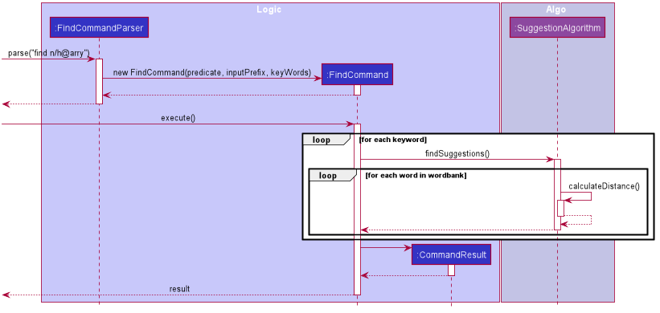

#### Design Consideration

##### Aspect: Data structure for storing words 

 * **Alternative 1: Using Damerau-Levenstien Algorithm (Currently Implemented)**
   The Damerau-Levenstien Algorithm will cover calculation for the edit distance for 3 kinds of String Differences as mentioned above 
   * Pros:   Will provide an accurate measure of the closest matching word based on the distance  
   First letter need not match the keyword (First letter might be typed wrongly too)
   * Cons:  
    Incurs either a large time complexity (3^n) where n is length of string to be compared with (No Memoization)  
   Incurs a large space consumption (construction of 2D Array) (With Memoization)

   * **Alternative 2: Storing all words in a Trie**  
   Store all words into a Trie Data structure and use recursion to find the matching words.
   * Pros: Easy to implement, consumes less time and space than Alternative 1
   * Cons:   Words must start with the same letter, hence its on the assumption that 1st letter of the word is not 
   misspelt.  
   Difficult to find transpositional errors (Eg. Harry vs Hrary)

Alternative 1 was ultimately chosen as it is difficult to predict what type of typing errors will be committed. Hence, analysing
missing, additional or transpositional letters are equally important. It is also naive to assume that users will not type the first
letter wrongly too. In addition, there was no noticeable degradation of performance during testing using Alternative 1. Since Alternative 1
provided a better solution to a Suggestion Feature with no noticeable performance slowdown, it was hence chosen. 

### Add Goal feature

#### Implementation

*bookmark* allows Users to add notes to a book.

This feature is facilitated mainly by `LogicManager`, `GoalCommandParser`, `GoalCommand` and `Book`.

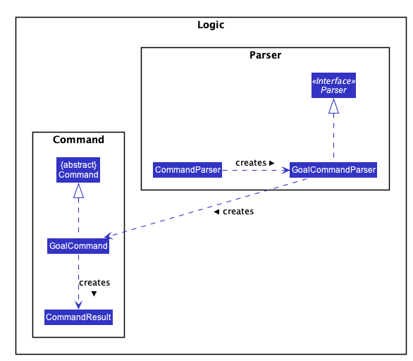

`LogicManager#execute()` (not shown in the diagram above) handles the command word to create 
`GoalCommandParser` to parse the remaining inputs. `GoalCommandParser#parse()` tokenizes each prefix
to create a `Goal` object. This `Goal` object will be passed as a parameter to create a `GoalCommand`
that will be returned to `Logic Manager`.\
*If there are missing or invalid parameters in command, an exception will be thrown with a 
message to the User.*

Below is an activity diagram which illustrates the flow of events for adding a Goal.

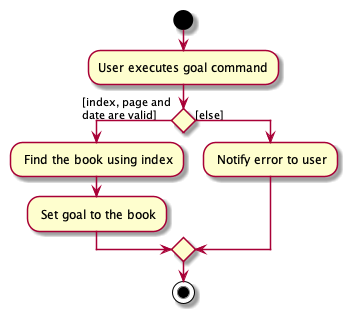

Below is a sequence diagram which illustrates a scenario where a User adds a valid Goal
to a valid book via Command: `goal 1 p/69 d/10-12-2020`

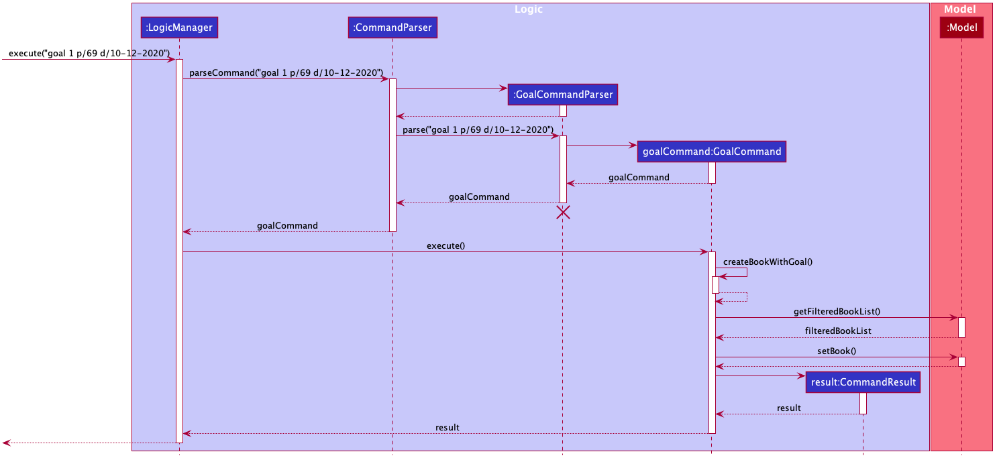

### Add Note feature

#### Implementation

*bookmark* allows Users to add notes to a book.

This feature is facilitated mainly by `AddNoteCommandParser` and `AddNoteCommand`.

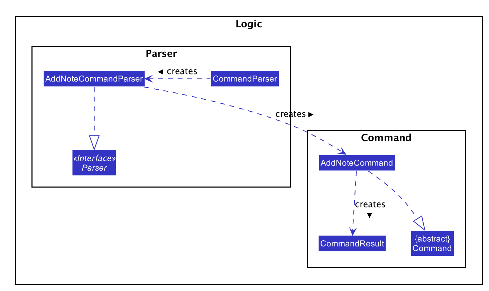

`LogicManager#execute()` (not shown in the diagram above) handles the command word to create `AddNoteCommandParser` to parse the remaining inputs.
`AddNoteCommandParser#parse()` tokenizes each prefix to create a `Note` object. This `Note` object will be
passed as a parameter to create a `AddNoteCommand` that will be returned to `LogicManager`. 
*If there are missing or invalid prefixes, an exception will be thrown with a message to the User.*

`LogicManager#execute()` will call `AddNoteCommand#execute()` to add the `Book` with the added `Note` into
the `Model` and return a `CommandResult` as a feedback to the user.
*If there is an existing note with the same title and text, an exception will be thrown with a message to the User*

Below is an activity diagram which illustrates the flow of events for adding a book

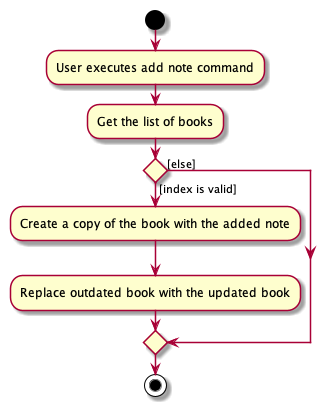

Below is a sequence diagram which illustrates the a scenario where a User adds a valid note to a valid book 
Command: `note 1 n/Thoughts txt/Something`

### Undo/redo feature
#### Implementation

The undo/redo mechanism is implemented by storing the state of the application after each command. The state of the 
application can be divided into two components:
   1. The state of the [Model](#model-component)
   2. The state of the [Ui](#ui-component)

The state of the Model is managed by `HistoryManager`. It does so by storing `State` objects. Each `State` object contains a 
`ReadOnlyLibrary`, `ReadOnlyUserPrefs` and a `Predicate` used to decide which books stored in the Model should be visible to
users. `HistoryManager` maintains a current state property representing the current state of the Model. It also stores 
previous states that be restored via a redo or undo.

* `HistoryManager#addNewState()` — Adds a new state to be used as the current state
* `HistoryManager#undo()` — Restores the most recent previous state.
* `HistoryManager#redo()` — Restores the most recently undone state.

The state of the Ui is managed by `ViewTypeManager`. 
The state of the Ui refers to what `ViewType` the Ui is in (see [Changing Ui View](#changing-ui-view)).
`ViewTypeManager` maintains a mapping between `State` objects and a `ViewType`. This mapping indicates what 
`ViewType` the Ui should be given a particular `State` of the Model.

* `ViewTypeManager#addViewTypePairing()` — Adds a new pairing between a given `State` and `ViewType`
* `ViewTypeManager#getViewType()` — Get the correct `ViewType` for the given `State`

Whenever the user enters any commands EXCEPT:
   * `help`
   * `exit`
   * `undo` and `redo` itself
   
the method `Model#save()` will be called which adds a new `State`, representing the new state of the Model, to `HistoryManager`
and causes `HistoryManager` to store the previous `State`. Additionally, `ViewTypeManager#addViewTypePairing()` will be 
called to create a new pairing between the newly created `State` and the appropriate `ViewType` to use to display the contents of the 
Model to the user. The stored `States` and its corresponding `ViewType` pairing will be used to change the application
state accordingly when a undo or redo operation, exposed as `Model#undo` and `Model#redo` respectively, is executed.

The class diagram below illustrates the classes that facilitates the undo and redo
feature.

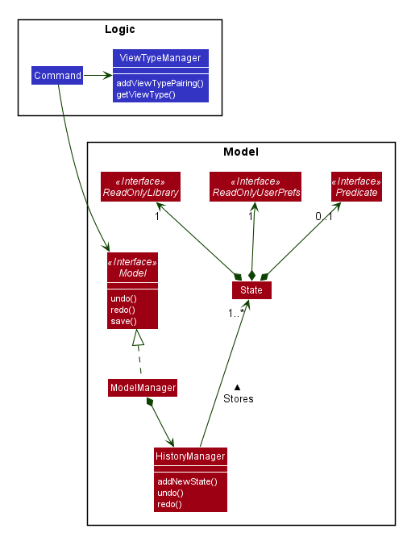

The next section will go into more detail about how the state of the application is managed as well as how undo and redo
executes.

#### How state is managed

`HistoryManager` manages state by keeping a current state variable as well as two deques, an undo deque and a redo deque.
The undo deque stores the states to be recovered via an undo command, while the redo deque stores previously undone states 
to be recovered via a redo command. `ViewTypeManager` maintains a map that maps `State` objects to a corresponding 
`ViewType`.

Below is an example to illustrate how undoing and redoing works in a typical scenario.

Step 1. The user launches the application for the first time. The `HistoryManager` will be inititalised with the
initial state of the model as the current state, i.e State 1. Undo and redo deques will be empty. `ViewTypeManager`'s map
will also only have 1 entry, mapping the initial `State` to `ViewType.DEFAULT`.

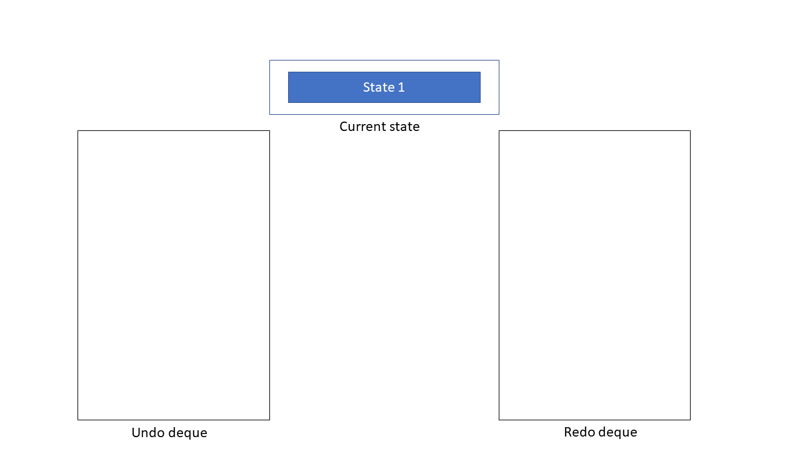

Step 2. The user executes add command to add a new book. The command will call the `Model#save()` method
which will create a new `State`, State 2, representing the new state of the Model and add it into `HistoryManager` via the 
`HistoryManager#addNewState()` method. State 2 will now be the current state while the previous current state, State 1,
will be pushed into the undo deque. `ViewTypeManager`'s map will be updated accordingly by calling the
`ViewTypeManager#addViewTypePairing()` method with State 2 and the correct `ViewType` to be used to display State 2 to 
the user.

:information_source: **Note:** If a command fails its execution, it will not call `Model#save()`, so the state will not be saved.

Step 3. The user decides that adding the book was a mistake and decides to undo the action by using the undo command.
This causes the current state, State 2 to be pushed to the redo deque. State 1 will be popped from the undo deque and 
made the current state. `ViewTypeManager#getViewType()` will be called with State 1 in order to get the correct 
`ViewType` to display State 1 with.

The following sequence diagram shows how the undo operation works:

Step 4. The user changes his mind again, deciding that he wants to add the book. He redoes the action by using the redo
command, causing the current state, State 1 to be pushed back into the undo deque and State 2 to be popped from the redo
deque and made the current state. Again, `ViewTypeManager#getViewType()` will be called to get the correct `ViewType`
to display State 2 with.

:information_source: **Note:** If the undo deque or redo deque is empty
when the user tries to undo and redo respectively, an error will be shown and no state change will occur.

Step 5. Now suppose the user adds a book and then edits a book, causing State 3 and State 4 to be created. He then
undoes the edit command. `HistoryManager` will now look like this:

Step 6: The user decides to then delete a book, causing State 5 to be created and made the current state.
The previous current state, State 3, will be pushed into the undo deque while the redo deque is cleared and 
hence State 4 is deleted.

This design choice of clearing the redo deque when a new state is added was made because states existing in the redo deque
cannot be represented in a linear, sequential path together with newly added states. Hence, it will be confusing
to allow users to redo to these states. To see this, we can plot the evolution of state changes in a sequential manner: 

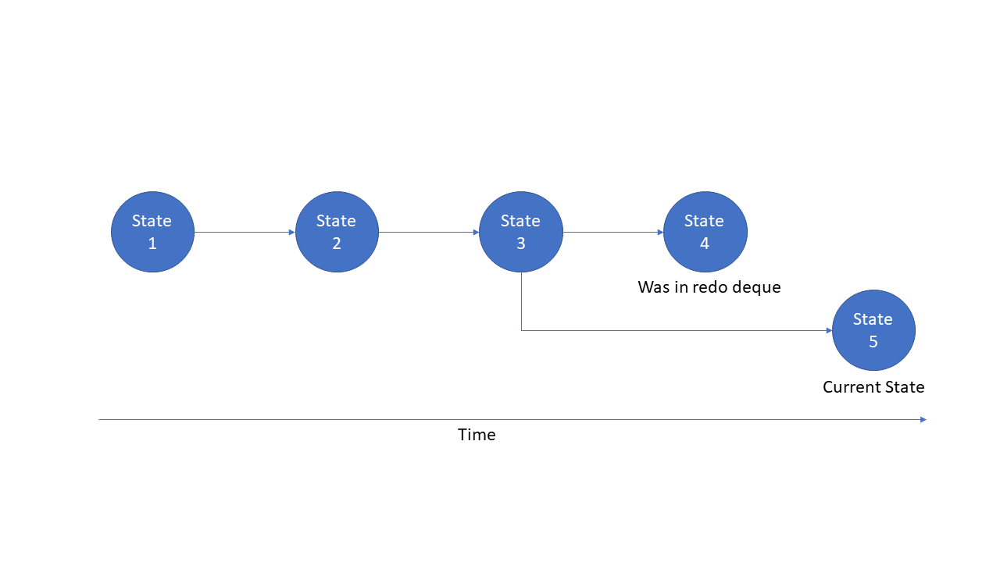

To get a clearer picture, we consider what could occur if the redo deque is not 
cleared upon adding new state into the `HistoryManager`. 

Consider a scenario where the redo deque originally contains some state. The user subsequently enters 
5 commands that each create a new state and the redo deque is never cleared upon new states being added.
Then, the user enters the redo command, causing the top-most state in the redo deque to be popped and made the current state. 
As a result, all the changes that the user has done through the 5 commands are removed in a single redo command, 
which is not the intended behaviour.

Furthermore, to prevent excessive memory usage, a cap on the number of states stored by `HistoryManager`'s undo deque
can be set in `HistoryManager#MAX_UNDO_COUNT`. If a new state is added but the undo deque is already at max capacity,
then the oldest state in the undo deque will be deleted to make room. A similar strategy is employed for `ViewTypeManager`,
with its map being implemented as a FIFO cache with a fixed maximum size.
The activity diagram below explains the flow of execution when a new state is added to `HistoryManager`.

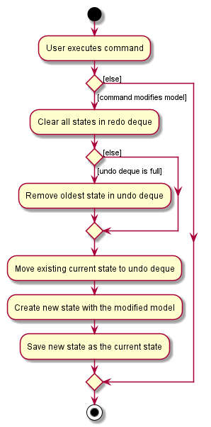

#### Design consideration:

##### Aspect: How undo & redo executes

* **Alternative 1 (current choice):** Saves copies of the entire `Library` and `UserPrefs` in `State`.
  * Pros: Easy to implement.
  * Cons: May have performance issues in terms of memory usage.

* **Alternative 2:** Individual command knows how to undo/redo by
  itself.
  * Pros: Will use less memory (e.g. for `delete`, just save the book being deleted).
  * Cons: We must ensure that the implementation of undoing/redoing of each individual command are correct, complexity builds up as more
  commands are added.
  
Alternative 1 was eventually chosen as there was no noticable performance degradation during testing with a reasonable 
cap (10) on the number of states stored. It is also much more scalable and less prone to breaking upon addition
or modification of commands. 

##### Aspect: How to decide which actions should create and save state
 
* **Alternative 1 (current choice):** Expose a method in the `Model` interface that when called creates and saves state.
  * Pros: More declarative, easier to see when the model will create and save state.
  * Cons: Worse separation of concerns, the responsibility of deciding when to create and save state is moved away 
    from the model and to the components that interact with the model.
    
* **Alternative 2:** The methods implemented by `ModelManager` to modify the model such as 
    `ModelManager#addBook()` also creates and save state.
  * Pros: Better separation of concerns, the model is responsible for deciding what actions constitute a modification
    and thus warrants the creation and saving of state.
  * Cons: The creation and saving of state becomes a side effect, not immediately clear that it occurs.  
    
Alternative 1 was eventually chosen as we liked the declarative nature of it as well as the clarity it provides. We also
felt that alternative 2 could cause a lot of problems if a command needed to modify the model in multiple ways thus
would cause multiple states to be created for a single command.

--------------------------------------------------------------------------------------------------------------------

## **Documentation, logging, testing, configuration, dev-ops**

* [Documentation guide](Documentation.md)
* [Testing guide](Testing.md)
* [Logging guide](Logging.md)
* [Configuration guide](Configuration.md)
* [DevOps guide](DevOps.md)

--------------------------------------------------------------------------------------------------------------------

## **Appendix: Requirements**

### Product scope

**Target user profile**:

* has a need to keep track of which page they stopped reading at for multiple books
* has a need to set reading goals and write reflections about what they read
* prefer desktop apps over other types
* can type fast
* prefers typing to mouse interactions
* is reasonably comfortable using CLI apps

**Value proposition**: Manage bookmarks faster than a typical mouse/GUI driven app. 
Removes the need for physical bookmarks. Help maintain the motivation to read by making reading more interactive.

### User stories

Priorities: High (must have) - `* * *`, Medium (nice to have) - `* *`, Low (unlikely to have) - `*`

| Priority | As a …​                                    | I want to …​                                                                 | So that I can…​                                                         |
| -------- | ------------------------------------------ | -------------------------------------------------------------------------- | ---------------------------------------------------------------------- |
| `* * *`  | user                                       | add a new book                                                             | track my progress                                                      |
| `* * *`  | user                                       | delete a book                                                              | remove books that I no longer read                                     |
| `* * *`  | user                                       | find a book by name                                                        | locate details of books without having to go through the entire list   |
| `* * *`  | user                                       | see all the data about a particular book (title, bookmark, progress)       | get all necessary information about my book                            |
| `* * *`  | user                                       | view a list of all the books and their progress                            | conveniently check my progress on all my books                         |
| `* * *`  | user                                       | update the data of a book                                                  |                                                                        |
| `* * *`  | user                                       | have an easy to use user interface                                                     | easily navigate through the system with minimal difficulty             |
| `* * *`  | user                                       | have a help page                                                           | find out how to use the app                                            |
| `* *`    | user                                       | classify my books according to genre                                       | organise my books better                                               |
| `* *`    | analytical user                            | write down my thoughts on a book                                           | re-read my analysis later                                              |
| `* *`    | user                                       | create my own classifications for genres not in the application            | organise the books to my liking                                        |
| `* *`    | Kindle user                                | have a clearer representation of my progress                               | conveniently get my progress without navigating to the Kindle screen   |
| `* *`    | user                                       | place tags or notes at different pages                                     | stop using sticky notes                                                |
| `* *`    | user                                       | have a few functions that I can use seamlessly                             | learn the app easily without bothering with large numbers of functions |
| `* *`    | user                                       | be able to edit my tags and reflections                                    | edit mistakes and typos                                                |
| `* *`    | careless user                              | undo any wrong commands that i’ve entered                                  |                                                                        |
| `* *`    | user                                       | be able to filter my books by Lexicographic order, Date, Reading, Finished | get the information I'm looking for                                    |
| `* *`    | beginner user                              | have default settings                                                      | skip configuring them at the start                                     |
| `*`      | user                                       | have a home page that summarises important details                         | conveniently access the most important information                     |
| `*`      | user                                       | have colour coded tags                                                     | so that I can easily differentiate important tags from the rest        |
| `*`      | user                                       | customise the look of the application                                      | make it feel personal                                                  |
| `*`      | user                                       | have a summary page for statistics on the books I've read                  |                                                                        |
| `*`      | user                                       | be able to resize the application                                          | fit it to different screens                                            |
| `*`      | user                                       | see and modify my current settings                                         |                                                                        |
| `*`      | user                                       | customise the background by uploading my own photo                         | customerize the look of the app to my liking                           |
| `*`      | forgetful user                             | keep track of my loaned books expiry date                                  | remember to return the book or extend the loan                         |
| `*`      | user                                       | have a visual representation of my loans expiry period                     | instantly know the urgency of each loan                                |
| `*`      | user                                       | set reminders for a book loan                                              | be reminded to return my book on time                                  |

### Use cases

For all use cases below, the **System** is `bookmark` and the **Actor** is the `user`, unless specified otherwise

**Use case: UC01 - Add a book**

**MSS**

1. User requests to add a book.
2. bookmark adds the book.

    Use case ends

**Extensions**

* 1a. User provides the wrong code.

    * 1a1. bookmark returns an error message.

    Use case ends.

* 1b. User provides a non-numeral for total pages or bookmarked page.

    * 1b1. bookmark returns an error message.

    Use case ends.

* 1c. Provided bookmarked page is larger than total pages.

    * 1c1. bookmark returns an error message.

    Use case ends.

**Use case: UC02 - View a book**

**MSS**

1. User <u>requests to list all books (UC05)</u>.
2. User requests to view a specific book using its index in the list.
3. bookmark returns all the book's information to user.

    Use case ends.

**Extensions**

* 2a. The index given is invalid.

    * 3a1. bookmark returns an error message.

      Use case resumes at step 2.

**Use case: UC03 - Delete a book**

**MSS**

1.  User <u>requests to list all books (UC05)</u>.
2.  User requests to delete a specific book using its index in the list.
3.  bookmark deletes the book.

    Use case ends.

**Extensions**

* 2a. The index given is invalid.

    * 2a1. bookmark returns an error message.

      Use case resumes at step 2.

**Use case: UC04 - Edit a book**

**MSS**

1. User <u>requests to list all books (UC05)</u>.
2. User requests to edit a specific book using its index on list.
3. The requested entry is updated.

    Use case ends.

**Extensions**

* 2a. The index given is invalid.

    * 2a1. bookmark returns an error message.

    Use case resumes at step 2.

 * 2b. The requested entry to update is invalid.

    * 2b1. bookmark returns an error message.

    Use case resumes at step 2.

 * 2c. The provided value for the entry to update is invalid.

    * 2c1. bookmark returns an error message.

    Use case resumes at step 2.

**Use Case: UC05 - List all books**

**MSS**

1. User requests to list all books.
2. bookmark returns a list of all books.

    Use case ends.

**Extensions**

* 1a. The book list is empty.
    * 1a1. bookmark returns a message informing user that book list is empty.

    Use case ends.

**Use Case: UC06 - Help**

**MSS**

1. User requests to see the Help page.
2. bookmark returns the Help page.

    Use case ends.

**Use Case: UC07 - Undo**

**MSS**

1. User requests to undo last action.
2. bookmark undoes the last user action.

    Use case ends.

**Extensions**

* 1a. There is no action to undo.
    * 1a1. bookmark returns a message informing user that there is no action to undo.
    
    Use case ends.

**Use Case: UC08 - Adding a goal**

**MSS**

1. User requests to add a goal to a specific book using its index in the list.
2. User specifies the goal target and deadline.
3. The goal is added to the book.

    Use case ends.

**Extensions**

* 3a. There is already a goal for the book.
    * 3a1. bookmark replaces the existing goal with the new goal.
    
    Use case resumes at step 3.

**Use Case: UC09 - Adding a note**

**MSS**

1. User requests to add a note to a specific book using its index in the list.
2. User specifies the note title and body.
3. The note is added to the book.

    Use case ends.

**Use Case: UC10 - Sorting the book list**

**MSS**

1. User requests to sort the book list by name.
2. bookmark sorts all the books by name.

    Use case ends.

### Non-Functional Requirements

1.  Should work on any _mainstream OS_ as long as it has Java `11` or above installed.
2.  Should be able to hold up to 100 books without a noticeable sluggishness in performance for typical usage.
3.  A user with above average typing speed for regular English text (i.e. not code, not system admin commands) should be able to accomplish most of the tasks faster using commands than using the mouse.
4.  Should be backwards compatible with data from previous versions.
5.  Should be not crash when data is given in compatible formats.
6.  The app should be accessible via the downloaded JAR file without any other installations needed.

*{More to be added}*

### Glossary

* **Mainstream OS**: Windows, Linux, Unix, OS-X

--------------------------------------------------------------------------------------------------------------------

## **Appendix: Instructions for manual testing**

Given below are instructions to test the app manually.

:information_source: **Note:** These instructions only provide a starting point for testers to work on;
testers are expected to do more *exploratory* testing.

### Launch and shutdown

1. Initial launch

   1. Download the bookmark.jar file and copy into an empty folder

   1. Double-click the bookmark.jar file Expected: Shows the GUI with a set of sample books. The window size may not be optimum.
   
   
:information_source: **Note:** If double clicking does not work,
   navigate to the folder containing the jar file using your terminal or command prompt and enter `java -jar bookmark.jar`
    
   

1. Saving window preferences

   1. Resize the window to an optimum size. Move the window to a different location. Close the window.

   1. Re-launch the app by double-clicking the jar file. 
       Expected: The most recent window size and location is retained.

### Deleting a book

1. Deleting a book while all books are being shown.

   1. Prerequisites: List all books using the `list` command. Multiple books in the list.

   1. Test case: `delete 1` 
      Expected: First book is deleted from the list. Details of the deleted book shown in the status message.

   1. Test case: `delete 0` 
      Expected: No book is deleted. Error details shown in the status message.

   1. Other incorrect delete commands to try: `delete`, `delete x`, `...` (where x is larger than the list size) 
      Expected: Similar to previous.

### Adding a book

1. Adding a book while all books are being shown.

   1. Test case: `add n/Test book g/Test genre tp/1000 b/50` 
      Expected: A book with the name of "Test book", genre of "Test genre", 1000 total pages and bookmark placed at page
      50 will be created and added to the list

   1. Test case: `add n/Test book g/T@st genre tp/1000 b/50` 
      Expected: No book is added. Error details shown in the status message.
   
   1. Other incorrect add commands to try: `add n/Test g/Test tp/X b/Y` where Y is larger than X  
      Expected: Similar to previous

2. Adding a book while only some books are being shown.

   1. Test case: `add n/Test book g/Test genre tp/1000 b/50` 
      Expected: A book with the name of "Test book", genre of "Test genre", 1000 total pages and bookmark placed at page
      50 will be created and added to the list. All books will be shown.  

### Editing a book

1. Editing a book while all books are being shown.

   1. Prerequisites: List all books using the `list` command. Multiple books in the list.

   1. Test case: `edit 1 n/Edited Name` 
      Expected: First book in the list is edited to have a name of "Edited Name"
      Details of the edited book shown in the status message.

   1. Test case: `edit 0 n/Edited Name` 
      Expected: No book is edited. Error details shown in the status message.

   1. Other incorrect delete commands to try: `edit`, `edit x`, `...` (where x is larger than the list size) 
      Expected: Similar to previous. 

1. Editing a book while only some books are being shown.

   1. Prerequisites: Book list filtered by a command (e.g `find` command). At least one book shown in the list.
   
   1. Test case: `edit 1 n/Edited Name` 
      Expected: First book in the list is edited to have a name of "Edited Name".
      Details of the edited book shown in the status message.
      The edited book remains in the list regardless of how it was edited.
      
### Sorting the book list

1. Sorting the book list while some books are being shown.

   1. Prerequisites: Book list is showing at least 2 books to see the sorting effect.
   
   1. Test case: `sort n/` 
      Expected: The books shown in the list will be sorted by their names in lexicographical order.
      
1. Adding a book into a sorted book list.

   1. Prerequisites: Book list is initially showing at least 1 books to see the sorting effect.
   1. Test case: `sort n/`  followed by `add` command to add another book.
      Expected: After the sort command, the books shown in the list will be sorted by their names in lexicographical order.
      The new book will be added to the book list in the correct position that maintains the sorted order.

### Undo 

1. Using undo when there are no commands to undo.

   1. Prerequisites: Must not have made any commands since starting the application.
   
   1. Test case: `undo` 
      Expected: Nothing is undone. Error details shown in status message.

1. Using undo when there are commands to undo.

   1. Test case: Any command except `help` and `exit` followed by `undo`
      Expected: The command entered is undone. The application reverts to exactly how it was before the command was
      made. Success message shown in status message.
      
### Redo

1. Using redo when there are no undone commands to redo.

   1. Prerequisites: Must not have used `undo` command since starting the application.
   
   1. Test case: `redo` 
      Expected: Nothing is redone. Error details shown in status message.

1. Using redo when there are undone commands to redo.

   1. Test case: Any command except `help` and `exit`, followed by `undo` and then `redo` 
      Expected: The command entered is first undone, then on using `redo`, it will be redone. The application will be 
      exactly as it was after the first  command was entered. Success message shown in status message.
      
### Saving data

1. Dealing with missing data files

   1. Prerequisites: Must have started the application at least once.
   
   1. Test case: In the folder containing `bookmark.jar`, delete the `data/library.json` file. Open the application. 
      Make some commands and then close the application with the `exit` command.  
      Expected: The application starts up with some sample data. On exit, the `data/library.json` file is created again,
      containing the new data.

1. Dealing with corrupted data files

   1. Prerequisites: Must have started the application at least once. At least one book stored in the data file.
   
   1. Test case: In the folder containing `bookmark.jar`, open the `data/library.json` file and edit it by removing the
      "name"" property from one of the JSON objects. This simulates a corrupted data file. Open the application. Make 
      some commands and then close the application with the `exit` command.  
      Expected: The application starts up with no books being displayed. On exit, the `data/library.json` file is recreated,
      containing the new data and will overwrite the "corrupted" data file.
      
   
:information_source: **Note:** In normal usage, users are not expected 
   to manually make changes to the JSON data file. 
   
   

