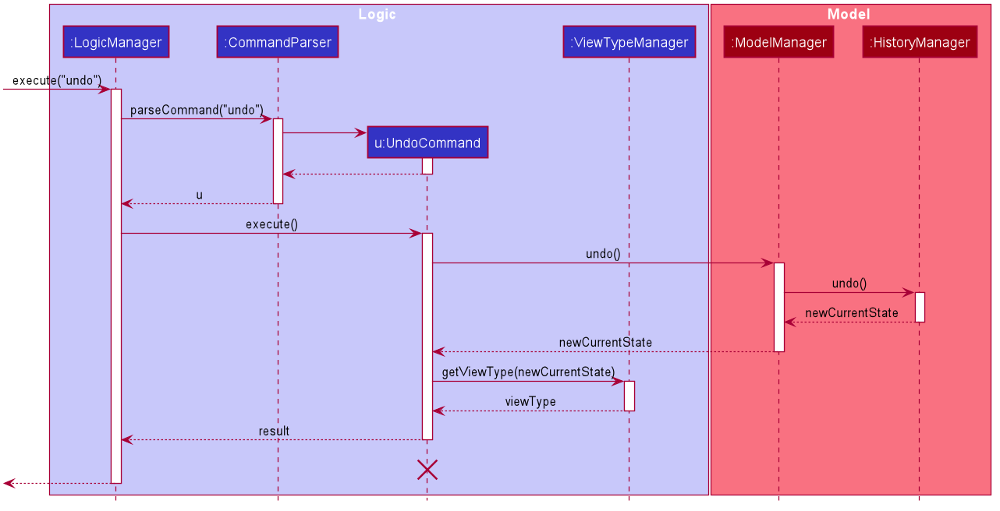
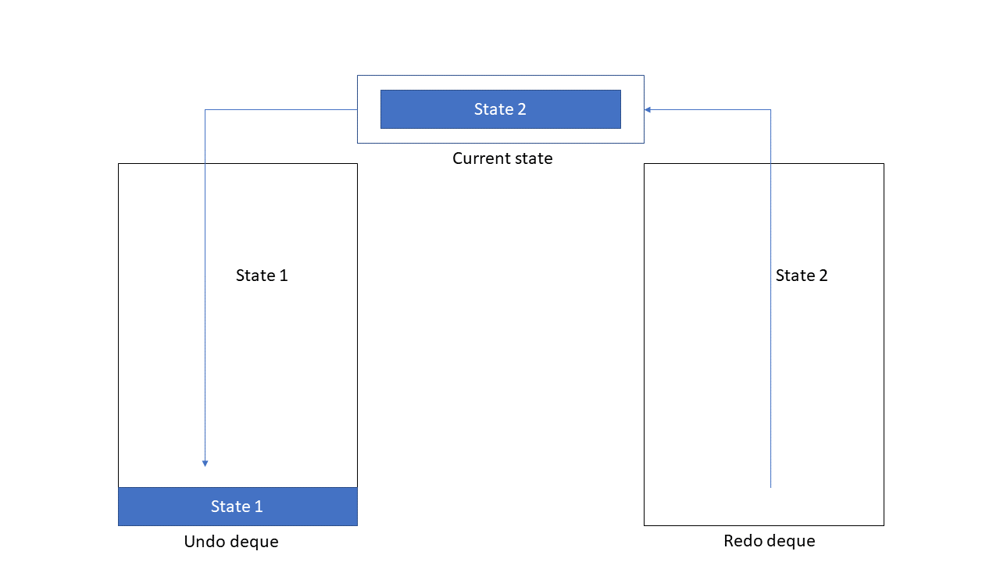
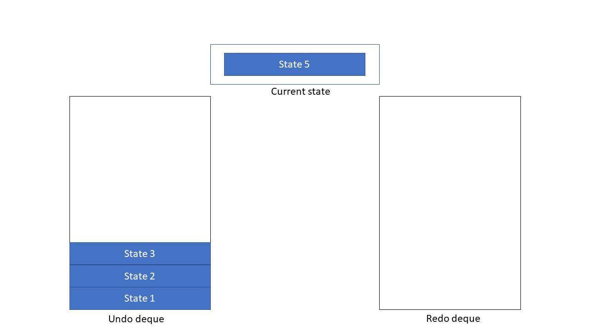

## Project: _bookmark_

_bookmark_ is a desktop book management application that allows user to manage their books and reading progress. It allows
users to track which page they stopped reading at. It also has features like adding goals and notes to help improve their reading
experience. A user will interact with _bookmark_ through a GUI created with JavaFx and
invoke commands through a Command Line Interface.

Given below are my contributions to the project.

### Summary of Contributions
* **Code contributed:** [RepoSense](https://nus-cs2103-ay2021s1.github.io/tp-dashboard/#breakdown=true&search=CS2103T-F13-2&sort=groupTitle&sortWithin=title&since=2020-08-14&timeframe=commit&mergegroup=&groupSelect=groupByRepos&checkedFileTypes=docs~functional-code~test-code~other&tabOpen=true&tabType=authorship&tabAuthor=TanLeYang&tabRepo=AY2021S1-CS2103T-F13-2%2Ftp%5Bmaster%5D&authorshipIsMergeGroup=false&authorshipFileTypes=docs~functional-code~test-code~other)

* **New Feature:** Added the ability to **undo previous commands** and **redo undone commands**.
  * What it does: Allows the user to undo previous commands or redo commands that have been undone.
  
  * Justification: This feature enhances the application by allowing the user to easily undo any mistakes made when
    entering a command. As an application that relies on a Command Line Interface, typing mistakes are inevitable, hence
    the undo command would be very useful in providing convenience to the user. The redo command also allows the user to
    move back and forth in history, allowing users to conveniently compare changes.
  
  * Highlights: This feature must work with all other commands as well as future commands to be added.
    Hence proper brainstorming and planning of the implementation had to be done to ensure the 
    implementation can be easily extended to work with future commands. Furthermore, the feature should not affect the
    speed of the application, hence care had to be taken to ensure redundant states are not stored in order to
    improve the memory efficiency. 
    The implementation was challenging as the application will display the book in different ways according to user entered
    commands, hence there was not only a need to keep track of the changes to the books stored,
    but also how the books were being displayed in order to allow the undo/redo command to bring the application back to
    exactly how it was.
    
  * Code contributed for this enhancement: [#115](https://github.com/AY2021S1-CS2103T-F13-2/tp/pull/115), 
    [#140](https://github.com/AY2021S1-CS2103T-F13-2/tp/pull/140)

* **New Feature:** Added ability for Ui to switch between a summarised and detailed view of the books stored.

  * What it does: Allows the user to select and view a specific book in detail. The application by default shows a 
    summarised view of books but users can use the view command to select a specific book and view its complete details. 
  
  * Justification: This feature enhances the application by ensuring that users are not overwhelmed by too much information.
    Some information, such as the content of the notes added to the books, will only be shown when viewing a book in
    detailed view. This prevents the Ui from being overcrowded with too much information and allows the user to focus
    their attention on a specific book of interest, improving user experience.
    
  * Highlights: This feature must work fast as switching between views should be as smooth as possible to ensure a good
    user experience. Hence, special care was taken to minimize unecessary re-renderings. Furthermore, the Ui needed to be
    in sync with changes to the Model. The above requirements were met using an implementation that applied the Observer
    design pattern. Additionally, as I had no prior experience with JavaFX, I had to pick up and learn JavaFX
    quickly in order to successfully implement this feature. 
  
  * Code contributed for this enhancement: [#92](https://github.com/AY2021S1-CS2103T-F13-2/tp/pull/92),
    [#121](https://github.com/AY2021S1-CS2103T-F13-2/tp/pull/121), [#165](https://github.com/AY2021S1-CS2103T-F13-2/tp/pull/165)
   
* **Enhancements to existing features:** 
  * Re-designed the Ui of _bookmark_. Added a sidebar to the Ui to display meta-data to user. [#92](https://github.com/AY2021S1-CS2103T-F13-2/tp/pull/92)
  * Added more thorough input validation for the user entered fields. [#130](https://github.com/AY2021S1-CS2103T-F13-2/tp/pull/130)  

* **Contributions to team member's enhancements:**
  * Did the initial refactoring of the code inherited from the AB3 project. [#76](https://github.com/AY2021S1-CS2103T-F13-2/tp/pull/76)

* **Documentation:** 
  * Developer Guide:
    * Wrote documentation and added UML diagrams for the `Ui view switching` and `Undo/redo` features. [#103](https://github.com/AY2021S1-CS2103T-F13-2/tp/pull/103),
        [#115](https://github.com/AY2021S1-CS2103T-F13-2/tp/pull/103)
    * Added more use cases into the Developer Guide. [#170](https://github.com/AY2021S1-CS2103T-F13-2/tp/pull/170)
    * Updated the manual testing section of the Developer Guide. [#170](https://github.com/AY2021S1-CS2103T-F13-2/tp/pull/170)
      
  * User Guide:
    * Wrote documentation for the `undo` and `redo` features. [#115](https://github.com/AY2021S1-CS2103T-F13-2/tp/pull/103)
  
* **Project Management and Dev Ops:**
  * Managed releases v1.2 and v1.3 on GitHub
  * Set up the team GitHub repo
  * Managed the team repo's issue tracker
  
* **Community:**
  * PRs reviewed (with non-trivial review comments): [#107](https://github.com/AY2021S1-CS2103T-F13-2/tp/pull/107),
    [#97](https://github.com/AY2021S1-CS2103T-F13-2/tp/pull/97), [#168](https://github.com/AY2021S1-CS2103T-F13-2/tp/pull/168),
    [#119](https://github.com/AY2021S1-CS2103T-F13-2/tp/pull/119)
  * Contributed to forum discussions (e.g [1](https://github.com/nus-cs2103-AY2021S1/forum/issues/170), [2](https://github.com/nus-cs2103-AY2021S1/forum/issues/182))
  * Reported bugs and suggestions for other teams in the class (e.g [1](https://github.com/TanLeYang/ped/issues/4),
  [2](https://github.com/TanLeYang/ped/issues/3), [3](https://github.com/TanLeYang/ped/issues/1))
  
### Contributions to the Developer Guide

Given below are the contributions I made to the Developer Guide.

### Changing Ui view

### Implementation

*bookmark's* UI supports two types of views: the default, **summarised view** which displays summarised information
regarding the books stored, and the **detailed view** which displays detailed information about a particular book.

`BookListPanel` `BookCard` as well as its corresponding subclasses `DetailedBookListPanel` and `DetailedBookCard` facilitates
the display of book information.
When in the summarised view, `MainWindow` renders `BookListPanel` which displays the book information using `BookCard`,
while in the detailed view, `DetailedBookListPanel` is rendered which displays the book information using
`DetailedBookCard`. `DetailedBookCard` will in turn use other components to display the book information,
such as `NoteCard` to display the notes added to a book.

Both `BookListPanel` and `DetailedBookListPanel` makes use of JavaFX's `ListView` to display the `BookCard` or `DetailedBookCard`
respectively.

The class diagram below shows the relevant classes involved:

#### Switching between the two views

`MainWindow` and `CommandResult` facilitates the switching between the two views.

`MainWindow#executeCommand()` initializes all changes to what is displayed by the UI by calling `Logic#execute()`
which returns a `CommandResult`. `MainWindow#executeCommand()` is called when user enters a command into the application.
From the returned `CommandResult`, `CommandResult#getViewType()` indicates how the UI should switch its view.
`CommandResult#getViewType()` returns a `ViewType`, of which there are three types: 
   * `ViewType.DEFAULT` - Instructs UI to switch to the default, summarised view
   * `ViewType.DETAILED` - Instructs UI to switch to the detailed, single book view
   * `ViewType.MOST_RECENTLY_USED` - Instructs UI to stay in whatever view it is in

Based on the type of `ViewType` returned by `CommandResult#getViewType()`, `MainWindow#resetView()`,
`MainWindow#changeToDetailedView()`, or no method is called accordingly.

The activity diagram below illustrates the flow of execution when the UI decides which view to use:

Below is a sequence diagram that shows a scenario whereby the UI switches from the default summarised view to the
detailed view:

#### Design considerations

##### Aspect: What to display DetailedBookCard with

* **Alternative 1 (current choice):** Use JavaFX ListView
  * Pros: Easy to keep UI up to sync with model by overriding ListCell's updateItem method
  * Cons: Extra care must be taken to not allow multiple books to be displayed as detailed view is only meant to show
  one book

* **Alternative 2:** Use other JavaFX layouts
  * Pros: More in-line with the purpose of the detailed view of showing only one book
  * Cons: More work has to be done to sync up the UI with the model.

### Undo/redo feature

#### Implementation

The undo/redo mechanism is implemented by storing the state of the application after each command. The state of the 
application can be divided into two components:
   1. The state of the [Model](#model-component)
   2. The state of the [Ui](#ui-component)

The state of the Model is managed by `HistoryManager`. It does so by storing `State` objects. Each `State` object contains a 
`ReadOnlyLibrary`, `ReadOnlyUserPrefs` and a `Predicate` used to decide which books stored in the Model should be visible to
users. `HistoryManager` maintains a current state property representing the current state of the Model. It also stores 
previous states that be restored via a redo or undo.

* `HistoryManager#addNewState()` — Adds a new state to be used as the current state
* `HistoryManager#undo()` — Restores the most recent previous state.
* `HistoryManager#redo()` — Restores the most recently undone state.

The state of the Ui is managed by `ViewTypeManager`. 
The state of the Ui refers to what `ViewType` the Ui is in (see [Changing Ui View](#changing-ui-view)).
`ViewTypeManager` maintains a mapping between `State` objects and a `ViewType`. This mapping indicates what 
`ViewType` the Ui should be given a particular `State` of the Model.

* `ViewTypeManager#addViewTypePairing()` — Adds a new pairing between a given `State` and `ViewType`
* `ViewTypeManager#getViewType()` — Get the correct `ViewType` for the given `State`

Whenever the user enters any commands EXCEPT:
   * `help`
   * `exit`
   * `undo` and `redo` itself
   
the method `Model#save()` will be called which adds a new `State`, representing the new state of the Model, to `HistoryManager`
and causes `HistoryManager` to store the previous `State`. Additionally, `ViewTypeManager#addViewTypePairing()` will be 
called to create a new pairing between the newly created `State` and the appropriate `ViewType` to use to display the contents of the 
Model to the user. The stored `States` and its corresponding `ViewType` pairing will be used to change the application
state accordingly when a undo or redo operation, exposed as `Model#undo()` and `Model#redo()` respectively, is executed.

The class diagram below illustrates the classes that facilitates the undo and redo
feature.

The next section will go into more detail about how the state of the application is managed as well as how undo and redo
executes.

#### How state is managed

`HistoryManager` manages state by keeping a current state variable as well as two deques, an undo deque and a redo deque.
The undo deque stores the states to be recovered via an undo command, while the redo deque stores previously undone states 
to be recovered via a redo command. `ViewTypeManager` maintains a map that maps `State` objects to a corresponding 
`ViewType`.

Below is an example to illustrate how undoing and redoing works in a typical scenario.

Step 1. The user launches the application for the first time. The `HistoryManager` will be inititalised with the
initial state of the model as the current state, i.e State 1. Undo and redo deques will be empty. `ViewTypeManager`'s map
will also only have 1 entry, mapping the initial `State` to `ViewType.DEFAULT`.

Step 2. The user executes add command to add a new book. The command will call the `Model#save()` method
which will create a new `State`, State 2, representing the new state of the Model and add it into `HistoryManager` via the 
`HistoryManager#addNewState()` method. State 2 will now be the current state while the previous current state, State 1,
will be pushed into the undo deque. `ViewTypeManager`'s map will be updated accordingly by calling the
`ViewTypeManager#addViewTypePairing()` method with State 2 and the correct `ViewType` to be used to display State 2 to 
the user.

:information_source: **Note:** If a command fails its execution, it will not call `Model#save()`, so the state will not be saved.

Step 3. The user decides that adding the book was a mistake and decides to undo the action by using the undo command.
This causes the current state, State 2 to be pushed to the redo deque. State 1 will be popped from the undo deque and 
made the current state. `ViewTypeManager#getViewType()` will be called with State 1 in order to get the correct 
`ViewType` to display State 1 with.

The following sequence diagram shows how the undo operation works:

Step 4. The user changes his mind again, deciding that he wants to add the book. He redoes the action by using the redo
command, causing the current state, State 1 to be pushed back into the undo deque and State 2 to be popped from the redo
deque and made the current state. Again, `ViewTypeManager#getViewType()` will be called to get the correct `ViewType`
to display State 2 with.

:information_source: **Note:** If the undo deque or redo deque is empty
when the user tries to undo and redo respectively, an error will be shown and no state change will occur.

Step 5. Now suppose the user adds a book and then edits a book, causing State 3 and State 4 to be created. He then
undoes the edit command. `HistoryManager` will now look like this:

Step 6: The user decides to then delete a book, causing State 5 to be created and made the current state.
The previous current state, State 3, will be pushed into the undo deque while the redo deque is cleared and 
hence State 4 is deleted.

This design choice of clearing the redo deque when a new state is added was made because states existing in the redo deque
cannot be represented in a linear, sequential path together with newly added states. Hence, it will be confusing
to allow users to redo to these states. To see this, we can plot the evolution of state changes in a sequential manner: 

To get a clearer picture, we consider what could occur if the redo deque is not 
cleared upon adding new state into the `HistoryManager`. 

Consider a scenario where the redo deque originally contains some state. The user subsequently enters 
5 commands that each create a new state and the redo deque is never cleared upon new states being added.
Then, the user enters the redo command, causing the top-most state in the redo deque to be popped and made the current state. 
As a result, all the changes that the user has done through the 5 commands are removed in a single redo command, 
which is not the intended behaviour.

Furthermore, to prevent excessive memory usage, a cap on the number of states stored by `HistoryManager`'s undo deque
can be set in `HistoryManager#MAX_UNDO_COUNT`. If a new state is added but the undo deque is already at max capacity,
then the oldest state in the undo deque will be deleted to make room. A similar strategy is employed for `ViewTypeManager`,
with its map being implemented as a FIFO cache with a fixed maximum size.
The activity diagram below explains the flow of execution when a new state is added to `HistoryManager`.

#### Design considerations

##### Aspect: How undo & redo executes

* **Alternative 1 (current choice):** Saves copies of the entire `Library` and `UserPrefs` in `State`.
  * Pros: Easy to implement.
  * Cons: May have performance issues in terms of memory usage.

* **Alternative 2:** Individual command knows how to undo/redo by
  itself.
  * Pros: Will use less memory (e.g. for `delete`, just save the book being deleted).
  * Cons: We must ensure that the implementation of undoing/redoing of each individual command are correct, complexity builds up as more
  commands are added.
  
Alternative 1 was eventually chosen as there was no noticable performance degradation during testing with a reasonable 
cap (10) on the number of states stored. It is also much more scalable and less prone to breaking upon addition
or modification of commands. 

##### Aspect: How to decide which actions should create and save state
 
* **Alternative 1 (current choice):** Expose a method in the `Model` interface that when called creates and saves state.
  * Pros: More declarative, easier to see when the model will create and save state.
  * Cons: Worse separation of concerns, the responsibility of deciding when to create and save state is moved away 
    from the model and to the components that interact with the model.
    
* **Alternative 2:** The methods implemented by `ModelManager` to modify the model such as 
    `ModelManager#addBook()` also creates and save state.
  * Pros: Better separation of concerns, the model is responsible for deciding what actions constitute a modification
    and thus warrants the creation and saving of state.
  * Cons: The creation and saving of state becomes a side effect, not immediately clear that it occurs.  
    
Alternative 1 was eventually chosen as we liked the declarative nature of it as well as the clarity it provides. We also
felt that alternative 2 could cause a lot of problems if a command needed to modify the model in multiple ways thus
would cause multiple states to be created for a single command.
